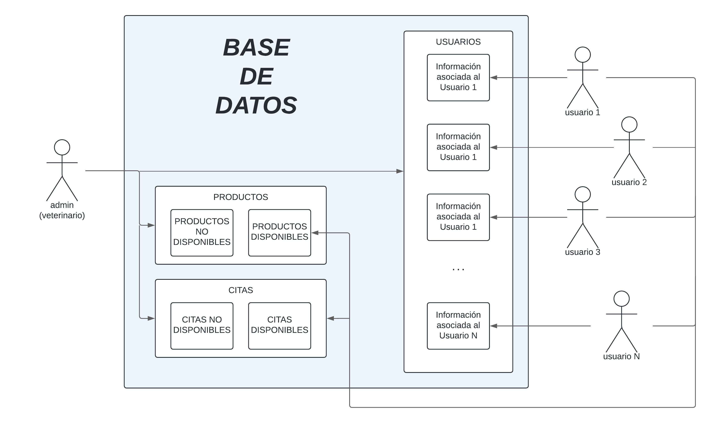

<center> <h1> PROYECTO DE PRÁCTICAS </h1></center>


**Alumno:** Alejandro Arroyo Loaisa [ *aal00052* ]

**Asignaturas**:
- Sistemas de Información basados en Web
- Sistemas de Información para el Negocio Electrónico
- Bases de Datos Distribuidas

**Profesores:** 
- Lina Guadalupe García Cabrera - (SIWEB)
- Carlos J. Ogayar Anguita - (SINE)
- Carmen Martínez Cruz - (BBDDD)

**Universidad de Jaén - 2024**


## **PLAN DE INVESTIGACIÓN**

Se va a realizar un proyecto de prácticas en conjunto para las asignaturas mencionadas anteriormente. Este consiste en la realización de un sitio web (cliente, servidor y base de datos), de temática libre.

El alumno encargado de este GitHub ha decidido realizar su proyecto atendiendo el siguiente tema:

### Clínica Veterinaria La Florida

Es una **Clínica Veterinaria** que atiende a **Perros, Gatos y Animales Exóticos**. Los servicios que ofrecen son: *Ecografía y ecocardiografía, Hospital, Cirugía, Radiología digital, Laboratorio y Consulta veterinaria*. Cuentan con un **Servicio 24h para emergencias**. Además, la empresa cuenta con un servicio de **peluquería canina**, en el que lavan, cortan el pelo, cepillan y peinan a los perros, entre otros cuidados estéticos. También **venden algunos productos de alimentación para mascotas y medicamentos** para estas.

A cargo de la Clínica Veterinaria se encuentran **don Alfonso**, el veterinario, y **doña Pilar**, la auxiliar de veterinaria y peluquera canina. Ambos tienen 31 años de experiencia, ya que el negocio lleva abierto desde 1993. Además cuentan con amplia formación en cada uno de sus ámbitos.

Don Alfonso es el veterinario jefe, con el que se contactará y quien le atenderá en la mayoría de los casos. Si no, doña Pilar estará también disponible para atenderle cuando lo necesite, si don Alfonso no está libre.

Información de contacto recogida:

- **DIRECCIÓN:** Calle Pintor El Greco, 9 - Linares (JAÉN)

- **TELÉFONO FIJO DE CONTACTO:** 953 692 416

- **TELÉFONO MÓVIL DE CONTACTO:** 655 586 583


El negocio busca la creación y publicación de un sitio web para promocionar los servicios que ofrece la Clínica Veterinaria, además de poner a disposición de los clientes un servicio de usuarios en el que se podrán registrar mascotas, consultar el historial clínico de estas, solicitar cita en la veterinaria, comprar productos… entre otros.

Don Alfonso, el veterinario, comenta que ya cuentan con sitio web, siendo este el siguiente:

[https://www.clinicaveterinarialaflorida.es/](https://www.clinicaveterinarialaflorida.es/)

El sitio web con el que ya cuenta la organización cuenta solo con información acerca de la Clínica Veterinaria, servicios que ofrece e información de contacto. Desgraciadamente, comenta don Alfonso, todavía no cuentan con sistema de usuarios y registros en línea, todo esto lo manejan en papel *in situ* en el negocio o mediante una base de datos en su computadora, pero no con el cliente.

Con la creación del sitio web, la Clínica Veterinaria "La Florida" busca atraer los siguientes perfiles de usuario:

- Cualquier usuario que requiera de servicios veterinarios en la localidad de la organización y busque información por internet.

- Cualquier usuario que ya sea cliente de la organización y quiera consultar la información del registro de su mascota en la Clínica Veterinaria.

- Cualquier usuario que, sea cliente o no, quiera pedir cita en la Clínica Veterinaria.

- Cualquier usuario que quiera comprar productos para su mascota que estén disponibles en la página web.

Entre otros. La finalidad es crear un sitio web que de servicio adicional al cliente y sea distintivo respecto de otras Clínicas Veterinarias.

Después de recabar toda esta información a través de su página web y mediante entrevista telefónica con el veterinario, el alumno se ha desplazado hasta el negocio para entrevistar a varios de los clientes mientras esperan a ser atendidos. Las preguntas han sido las siguientes:

- **¿Es usted cliente de la Clínica Veterinaria “La Florida”?**
- **¿Cuántas mascotas tiene? ¿Le resulta complicado recordar los tratamientos que reciben o deben recibir las mascotas que tiene?**
- **¿Encontraría útil una página web de la Clínica Veterinaria “La Florida”, con información de los servicios que ofrece, entre otros?**
- **Como cliente, ¿qué le gustaría encontrar en dicha página web?**
- **¿Considera que espera mucho tiempo para ser atendido?**
- **¿Usaría un servicio en línea de este negocio para registrar sus mascotas, tener a su disposición su historial veterinario y pedir cita en línea?**
- **¿Compra productos en la Clínica Veterinaria “La Florida”? ¿Encontraría cómodo la compra en línea de estos y posterior envío hasta la puerta de su casa?**

Estas han sido las respuestas del **Entrevistado nº1**:

| PREGUNTA | RESPUESTA |
|----------|----------|
| **¿Es usted cliente de la Clínica Veterinaria “La Florida”?**   | "Sí."   |
| **¿Cuántas mascotas tiene? ¿Le resulta complicado recordar los tratamientos que reciben o deben recibir las mascotas que tiene?**    | "Tengo tres mascotas, dos perros y un gato. La verdad que es un poco tedioso saber qué le toca a cada una, pero por suerte tenemos las cartillas de los animales para recordarlo. Aún así, no son muy cómodas y luego una se olvida. Ya me ha pasado que he llegado un par de semanas tarde a una vacunación porque olvido la existencia de las cartillas."   |
| **¿Encontraría útil una página web de la Clínica Veterinaria “La Florida”, con información de los servicios que ofrece, entre otros?**    | "Por supuesto, no veo por qué no. Incluso me vendría bien para recomendarla a mis amigas, porque conozco a Alfonso desde hace años que les traigo mis mascotas y siempre les hablo muy bien de él, pero no suelo tener qué enseñarles."   |
| **Como cliente, ¿qué le gustaría encontrar en dicha página web?**    | "Pues la verdad, me gustaría deshacerme ya de las cartillas y tal, que me avisasen por ahí de manera digital de lo que debo hacer con mis mascotas sería muy útil."   |
| **¿Considera que espera mucho tiempo para ser atendido?**    | "Llevo años viniendo, y hay un poco de todo. A veces vienes y está todo el mundo aquí, que pensó como tú, y hala todos esperando. Es una lata porque puedes echar toda la mañana, pero bueno, no es culpa de don Alfonso si todos hemos querido venir a la vez. Aún así luego hay otras veces que recién llego entro directa."   |
| **¿Usaría un servicio en línea de este negocio para registrar sus mascotas, tener a su disposición su historial veterinario y pedir cita en línea?**    | "Ay me encantaría, es lo que te decía antes de la cartilla. Prefiero llevarlo todo en el móvil, se me hace más asequible que cargar con los cuadernillos de cada mascota. Y lo de las citas suena perfecto para ahorrarnos tiempo, porque luego si sé que tengo que traer a mis mascotas, sé que tengo que pedir la mañana o la tarde libre en el trabajo porque se van a juntar muchas personas y es una pena. Así podemos venir cuando nos toque y ya."   |
| **¿Compra productos en la Clínica Veterinaria “La Florida”? ¿Encontraría cómodo la compra en línea de estos y posterior envío hasta la puerta de su casa?**    | "Sí, compro pienso y algunos medicamentos de las mascotas. Sinceramente, lo único que me gustaría que me trajeran a mi casa sería el pienso porque ya sabes lo que pesa eso. Sí lo vería buena idea."  |


Estas han sido las respuestas del **Entrevistado nº2**:

| PREGUNTA | RESPUESTA |
|----------|----------|
| **¿Es usted cliente de la Clínica Veterinaria “La Florida”?**   | "No. He venido solo un par de veces, cuando no pudo recibirme mi veterinario habitual. Vengo por recomendación."   |
| **¿Cuántas mascotas tiene? ¿Le resulta complicado recordar los tratamientos que reciben o deben recibir las mascotas que tiene?**    | "Tengo uno, un perro. Y no, no me cuesta recordarlo porque ya está mayorcete y pues no tiene tantos tratamientos. Aunque sí es verdad que fue un lío al principio cuando lo adoptamos de pequeño, recordar todas esas cosas o siquiera encontrar dónde habíamos puesto la cartilla."  |
| **¿Encontraría útil una página web de la Clínica Veterinaria “La Florida”, con información de los servicios que ofrece, entre otros?**    | "Sí. Porque no soy cliente y vengo por recomendación, así antes de venir puedo mirar todo lo que ofrecen y ver si de verdad darían un buen servicio. Para estar seguro, vamos."   |
| **Como cliente, ¿qué le gustaría encontrar en dicha página web?**    | "Justo lo que te acabo de decir, un poco de todo lo que ofrecen. También imágenes para ver las instalaciones, quizás incluso precios, para no llevarme sorpresas. Todo eso."   |
| **¿Considera que espera mucho tiempo para ser atendido?**    | "Qué va. Bueno, yo es que solo he venido dos veces y las dos fueron super rápido."   |
| **¿Usaría un servicio en línea de este negocio para registrar sus mascotas, tener a su disposición su historial veterinario y pedir cita en línea?**    | "Me encantaría. Eso no lo he visto nunca y no lo tiene mi clínica, la verdad se me hace super novedoso y me encantaría poder gestionar la información y servicios de mis mascotas desde el teléfono en cualquier momento, incluso lo de pedir cita me parece una idea increible."   |
| **¿Compra productos en la Clínica Veterinaria “La Florida”? ¿Encontraría cómodo la compra en línea de estos y posterior envío hasta la puerta de su casa?**    | "No, nunca he comprado nada aquí. Pero me podría empezar a plantear comprar alguna que otra cosa que necesito con frecuencia para mi perro si ellos tienen ese sistema."   |

Se ha enseñado estas dos entrevistas al veterinario, **don Alfonso**, y este ha sacado las siguientes conclusiones:

“*La verdad que después de tantos años en el sector, nunca nos habíamos parado a pensar en la importancia de estar al servicio del cliente fuera de las puertas de nuestra Clínica Veterinaria. El cliente debe tener a la mano acceso a toda la información de sus mascotas, desde la comodidad de su casa o desde cualquier lado desde donde le interese consultarla. Además, siempre nos hemos encontrado con un problema en todo este tiempo: la gente cuando tiene que traer su mascota, simplemente viene y espera su turno. Esto se traduce en tiempos de espera, a veces, altos, debido a que cada uno viene “cuando le viene bien” o “cuando le da la gana”. No tenemos sistema de turnos o citas, e incluir algo así a disposición del cliente y cómodamente desde la web, sería algo beneficioso tanto para ellos como para nosotros. Todas estas cosas nos adaptarían a los tiempos actuales y nos darían un factor diferenciador del resto de negocios de la localidad, los cuales ninguno dispone de estas facilidades.*”


También, **doña Pilar**, la auxiliar veterinaria y peluquera canina, comenta lo siguiente:

“*Para la peluquería de la clínica siempre he tenido una agenda que me he hartado de llenar todos los años, y a veces ha sido un lío gestionarme las horas en las que tenía que atender a las mascotas de los clientes. Es la única parte del negocio que sí requiere de cita previa, y se solicita por teléfono. Otras veces, incluso, llamaban para pedir cita en un horario en el que yo no estaba en la Clínica Veterinaria, y no podía dársela porque no tenía la agenda a mano, la cual se encontraba en el negocio. Así que con un sistema de citas en línea, me quitaría de todos estos problemas, y los clientes podrían ver qué días hay huecos y a qué horas les viene mejor, sin tener que levantar el teléfono.*”


## **ANTEPROYECTO**


### Título
Clínica Veterinaria La Florida

### Breve descripción del proyecto
Se va a realizar un sitio web (cliente, servidor y base de datos) para las asignaturas SIWEB, SINE y BBDDD de la carrera Ingeniería Informática de la Universidad de Jaén.

- **Sistemas de la información basados en Web:**
Se diseñará un sistema hipermedia para un sitio web, que incluya una estructura de información acerca de todo lo relacionado con la Clínica Veterinaria, y que incluya todo lo aprendido en la asignatura.
- **Sistemas de la información para el negocio electrónico:**
A este sitio web, se le añadirá una parte de negocio electrónico. Consistirá en un sistema de compra en línea de productos de la Clínica Veterinaria (desde piensos hasta medicamentos). 
- **Bases de datos distribuidas:**
Adicionalmente, se agregará una base de datos para que los clientes se registren y registren a sus mascotas. Además, esta base de datos almacenará los productos que se venden.

La creación de esta página web va orientada a atender las necesidades de información de clientes y no clientes acerca de la Clínica Veterinaria, como la diferenciación respecto de otros negocios agregando un sistema de clientes y compra en línea. El sitio web contará con todo tipo de imágenes y vídeos tomados *in situ* en el lugar, contando con la autorización escrita de los dueños del negocio. La información contenida será o habrá sido debidamente contrastada y aprobada por el propio veterinario, para que sea veraz y realmente útil para el usuario objetivo.

### Breve descripción de la organización o institución
Se trata de un Centro Veterinario que proporciona atención a Caninos, Felinos y Especies Exóticas. Los servicios que brindan incluyen: *Ultrasonido y ecocardiograma, Hospitalización, Cirugía, Radiografía digital, Laboratorio y Consultorio veterinario*. Disponen de un Servicio de Emergencias las 24 horas. Adicionalmente, la organización ofrece un servicio de estética canina, donde realizan baños, cortes de pelo, cepillado y peinado de perros, entre otros tratamientos de belleza. Asimismo, comercializan ciertos productos alimenticios para mascotas y medicamentos para las mismas.

### Tipo de proyecto
Es un proyecto de desarrollo software.

### Propósito del Proyecto

El propósito de este proyecto es desarrollar un sitio web integral para la Clínica Veterinaria La Florida que sirva como una plataforma informativa y de comercio electrónico. Este sitio web proporcionará información detallada sobre los servicios veterinarios ofrecidos por la clínica, permitirá a los clientes registrarse y registrar a sus mascotas, y ofrecerá una tienda en línea para la compra de productos para mascotas.

### Objetivos del Proyecto
[!NOTE] En la descripción e investigación anterior ya has fijado algunos tipos de contenidos y servicios que debe incluir tu sitio web. En los objetivos, debes incluir esa información, detalla más los objetivos.
1. **Diseñar un sistema hipermedia para el sitio web:** El objetivo es crear una estructura de información completa que incluya detalles sobre todos los aspectos de la Clínica Veterinaria La Florida. Esto incluirá información sobre los servicios ofrecidos, el personal, las instalaciones, y más.

2. **Implementar un sistema de comercio electrónico:** Se añadirá una funcionalidad de comercio electrónico al sitio web que permitirá a los clientes comprar productos de la clínica en línea. Esto incluirá una variedad de productos, desde alimentos para mascotas hasta medicamentos.

3. **Desarrollar una base de datos distribuida:** Se creará una base de datos que permitirá a los clientes registrarse y registrar a sus mascotas. Esta base de datos también almacenará información sobre los productos que se venden en la tienda en línea.

4. **Proporcionar información veraz y útil:** Toda la información contenida en el sitio web será contrastada y aprobada por el veterinario de la clínica para asegurar su veracidad y utilidad para los usuarios.

5. **Diferenciarse de otros negocios similares:** A través de la implementación de un sistema de clientes y una tienda en línea, el sitio web buscará diferenciarse de otros negocios similares.

6. **Cumplir con los requisitos de las asignaturas SIWEB, SINE y BBDDD de la carrera Ingeniería Informática de la Universidad de Jaén.**

### Palabras clave
A continuación se incluye un listado de palabras clave relacionadas con la página web que se está diseñando y desarrollando:


| Clínica Veterinaria | Servicios Veterinarios | Atención de Emergencia | Cirugía Veterinaria | Vacunación de Mascotas |
| --- | --- | --- | --- | --- |

| Desparasitación | Microchip para Mascotas | Nutrición Animal | Medicina Preventiva | Diagnóstico por Imagen |
| --- | --- | --- | --- | --- |

| Radiografía para Mascotas | Ecografía Veterinaria | Cardiología Veterinaria | Dermatología Veterinaria | Oftalmología Veterinaria |
| --- | --- | --- | --- | --- |

| Odontología Veterinaria | Ortopedia Veterinaria | Endocrinología Veterinaria | Oncología Veterinaria | Neurología Veterinaria |
| --- | --- | --- | --- | --- |

| Medicina Felina | Medicina Canina | Medicina de Exóticos | Cuidado de Aves | Cuidado de Reptiles |
| --- | --- | --- | --- | --- |

| Cuidado de Roedores | Cuidado de Conejos | Cuidado de Hurones | Cuidado de Equinos | Cuidado de Animales de Granja |
| --- | --- | --- | --- | --- |

| Adopción de Mascotas | Consejos de Cuidado de Mascotas | Tienda de Productos para Mascotas | Alimentación para Mascotas | Accesorios para Mascotas |
| --- | --- | --- | --- | --- |

| Juguetes para Mascotas | Seguro para Mascotas | Cursos de Formación | Blog Veterinario | Contacto y Ubicación |
| --- | --- | --- | --- | --- |


    
### Metodología
[!NOTE] Puedes usar una medología ágil, nosotros aplicaremos más o menos "Metodología centrada en el usuario". Incorpora las distintas fases/tareas/métodos de forma breve. Puedes hacerlo a lo largo del cuatrimestre, cuando hagas uso en las distintas tareas relacionadas con el proyecto.


El proyecto durará cuatro meses: Febrero, Marzo, Abril y Mayo, de 2024. Se utilizará una Metodología Ágil SCRUM:

1. **Definición del Producto Backlog**: En esta etapa, identificamos todas las funcionalidades y requisitos del nuevo sitio web de la Clínica Veterinaria La Florida. Estos podrían incluir:
    - Creación de un sistema de registro de usuarios.
    - Implementación de un sistema de citas en línea.
    - Creación de una tienda en línea para productos de mascotas.
    - Implementación de un sistema para consultar el historial clínico de las mascotas.
    - Entre otros.
Es en la etapa en la que se encuentra el proyecto, a día de escritura de este Anteproyecto.

2. **Planificación del Sprint**: Seleccionamos las historias de usuario del Producto Backlog que se trabajarán en el próximo Sprint. Por ejemplo, podríamos comenzar con la creación del sistema de registro de usuarios y la implementación del sistema de citas en línea.

3. **Sprint**: Durante el Sprint, el alumno trabajará en las tareas seleccionadas. Cada día, el alumno reflexionará sobre su progreso y cualquier obstáculo que pueda haber surgido.

4. **Revisión del Sprint**: Al final del Sprint, el alumno presentará el trabajo completado a don Alfonso y doña Pilar. Se recopila feedback y se hacen ajustes según sea necesario.

5. **Retrospectiva del Sprint**: El alumno reflexionará sobre el Sprint pasado y buscará formas de mejorar. Por ejemplo, si hubo problemas con la comunicación o la gestión del tiempo, se reflexionan en esta etapa y se buscan soluciones para el próximo Sprint.

6. **Inicio del próximo Sprint**: El proceso se repite con la planificación del próximo Sprint. Basándonos en el feedback y los aprendizajes del Sprint anterior, seleccionamos nuevas historias de usuario para trabajar.

Este ciclo continúa hasta que se haya completado todo el trabajo en el Producto Backlog. Una de las claves de la metodología ágil es la adaptabilidad, por lo que el Producto Backlog puede cambiar y evolucionar a medida que se recibe más feedback y se comprenden mejor las necesidades del proyecto.

Las historias de usuario son una técnica utilizada en el desarrollo ágil para capturar una descripción de una funcionalidad del software desde la perspectiva del usuario final. Una historia de usuario se formula generalmente de la siguiente manera: “*Como [rol de usuario], quiero [objetivo] para que [beneficio]*”. Por ejemplo, en el caso de este proyecto, una historia de usuario podría ser: “*Como dueño de una mascota, quiero poder reservar citas en línea para que pueda programar visitas al veterinario de manera más conveniente*”.

Las historias de usuario ayudan a entender mejor las necesidades y expectativas de nuestro usuario final, y proporcionan un marco claro para diseñar y desarrollar nuevas funcionalidades. Además, permiten priorizar las tareas basándose en las necesidades reales de los usuarios.


### Resultados esperados
Se espera satisfacer los requisitos mínimos contemplados por las asignaturas para las que se realiza el proyecto, con el fin de adquirir los conocimientos, pero además del sitio web se espera:

1. **Sitio web funcional y fácil de usar**: El sitio web debe ser intuitivo y fácil de navegar para los usuarios. 

2. **Sistema de registro de usuarios**: Los usuarios deben poder crear una cuenta, iniciar sesión y gestionar su perfil.

3. **Sistema de citas en línea**: Los usuarios deben poder reservar citas con el veterinario a través del sitio web.

4. **Tienda en línea**: Los usuarios deben poder comprar productos para mascotas y medicamentos a través del sitio web.

5. **Sistema de consulta de historial clínico**: Los usuarios deben poder consultar el historial clínico de sus mascotas.

6. **Integración con la base de datos existente**: El sitio web debe estar integrado con la base de datos existente de la clínica para mantener un registro coherente y actualizado.

7. **Alta satisfacción del cliente**: Los usuarios deben encontrar útil el sitio web y estar satisfechos con su experiencia de usuario.

8. **Aumento del tráfico web y de las reservas/citas**: Con la implementación del nuevo sitio web, se espera un aumento en el número de visitantes al sitio web y en las reservas de citas.

9. **Formación y soporte**: Don Alfonso y doña Pilar deben estar formados para gestionar el nuevo sistema y debe haber soporte disponible para resolver cualquier problema que pueda surgir.


### Requisitos de hardware y software

Los requisitos del proyecto serán los mínimos necesarios para que se pueda llevar a cabo el desarrollo del mínimo, estos serán las especificaciones del ordenador donde se realiza, y los programas que se pretende utilizar.

Los requisitos de **HARDWARE** para la realización de este proyecto serán:

|  |  |
|----------|----------|
| **Sistema Operativo**  |   Windows 10  |
| **Procesador**  | Interl(R) Core(TM) i5-8300H CPU @ 2.30GHz 2.30GHz |
| **Memoria RAM** | 8GB, 7.81 usable |
| **Espacio Libre en Disco**  | El necesario para albergar todos los programas utilizados en el desarrollo del proyecto, y los datos que compongan el sitio web. |
| **Tarjeta gráfica**  | NVIDIA GeFore GTX 1050 |

Los requisitos **SOFTWARE** para la realización de este proyecto serán:

|  |  |
|----------|----------|
| **Lenguaje de Programación** | HTML, CSS, Javascript, SQL |
| **Entorno de Programación**  |   Visual Studio Code, NetBeans  |
| **Navegador**  | Mozilla Firefox |
| **Base de Datos** | MySQL |
| **Simular distribución de base de datos**  | Docker |
| **Diseño de Gráficos** | Adobe Photoshop, Paint |

Los requisitos han sido planteados en la fase de PLANIFICACIÓN del proyecto. Pueden ser alterados en cualquier etapa del proyecto, a conveniencia de este. Si esto ocurre, quedará indicado.

### Bibliografía y documentación

1. Dueñas Calderón, E. (2022). [Desarrollo e implementación de un sitio web para la gestión de la agenda e interacción con los clientes de clínicas veterinarias. Trabajo Fin de Grado, Escuela Técnica Superior de Ingeniería de Telecomunicación de la Universitat Politècnica de València.](https://riunet.upv.es/bitstream/handle/10251/181901/Duenas%20-%20Desarrollo%20e%20implementacion%20de%20un%20sitio%20web%20para%20la%20gestion%20de%20la%20agenda%20e%20interaccion%20c....pdf?sequence=1)
2. Gómez Martínez, P. I. (2019). [Diseño y desarrollo de un sistema de gestión para clínicas veterinarias. Memoria para optar al título de Ingeniero Civil en Computación, Universidad de Chile.](https://repositorio.uchile.cl/handle/2250/171069)
3. Rubio Velasco, D. (n.d.). [VeterSegovia. Aplicación web para la gestión de clínicas veterinarias. Universidad de Valladolid.](https://uvadoc.uva.es/bitstream/handle/10324/23979/TFG.B.972.pdf?sequence=1)
4. Mozilla. (s.f.). [MDN Web Docs.](https://developer.mozilla.org)
6. Refsnes Data. (s.f.). [W3Schools Online Web Tutorials.](https://www.w3schools.com)
7. Mozilla. (s.f.). [Learn web development. MDN Web Docs.](https://developer.mozilla.org/en-US/docs/Learn)


## **ESTUDIO DE USABILIDAD**

Se va a realizar un estudio de usabilidad. Un estudio de usabilidad de una página web es un análisis que se realiza para evaluar la eficacia, eficiencia y satisfacción con la que los usuarios pueden alcanzar sus objetivos en un sitio web. Se centra en entender cómo los usuarios interactúan con la web, identificando posibles problemas y áreas de mejora para optimizar la experiencia del usuario. En este caso: 

1. Se **reunirán cuatro páginas web** de Clínicas Veterinarias, es decir, relacionadas con el proyecto que se está llevando a cabo. Entre ellas, por supuesto, estará la de la organización para la que estamos trabajando. Las páginas sobre las que se trabajará son:

| Organización | Enlace al sitio web |
|----------|----------|
| **Clínica Veterinaria La Florida** | [https://www.clinicaveterinarialaflorida.es/](https://www.clinicaveterinarialaflorida.es/) |
| **Hospital Veterinario Albacora**  | [https://www.clinicaveterinariaalbacora.com/](https://www.clinicaveterinariaalbacora.com/) |
| **Clínica Veterinaria Mamíferos**  | [https://clinicaveterinariamamiferos.com/](https://clinicaveterinariamamiferos.com/) |
| **Clínica Veterinaria AniCura** | [https://www.anicura.es/clinicas/jaen-norte-clinica-veterinaria](https://www.anicura.es/clinicas/jaen-norte-clinica-veterinaria) |

2. Se contestarán unas **preguntas básicas de navegación** para cada sitio web. Estas son las siguientes:


    - ¿De qué va el sitio web? 
    - ¿En qué página estoy?  
    - ¿Cuáles son las principales secciones del sitio?  
    - ¿Qué opciones tengo en este nivel (navegación)? 
    - ¿Dónde estoy en el esquema del sitio? 
    - ¿Cómo busco algo? 

3. Una vez terminado este estudio previo, se realizará para cada sitio web un pequeño **análisis atendiendo a los principios de usabilidad**.
4. Al final se elaborará una **tabla resumen** con puntos fuertes, puntos débiles y formas de solucionarlo de los sitios analizados. La tabla seguirá el esquema:

| Puntos fuertes | Puntos débiles | Soluciones |
|--|--|--|
|-----|-----|-----|

### Clínica Veterinaria La Florida


- **¿De qué va el sitio?**

Es un sitio web sobre una Clínica Veterinaria. Concretamente, la de la empresa con la que queremos llevar a cabo este proyecto.
- **¿En qué página estoy?**

Se parte de la página “*Inicio*”. Es la página principal del sitio web, a la que probablemente accedamos al entrar en su URL desde el navegador tras la búsqueda de una clínica veterinaria.
- **¿Cuáles son las principales secciones del sitio?**

Las principales secciones del sitio web son: *Inicio, Perros, Gatos, Animales Exóticos, Servicios y Peluquería.*
- **¿Qué opciones tengo en este nivel (navegación)?**

Desde la página de “*Inicio*” se abren dos rutas de navegación:
1. Utilizar el Menú superior para entrar en cualquiera de las secciones principales del sitio web, listadas anteriormente.
2. Desplazar verticalmente la página principal, donde se presentan otras subsecciones con información interesante acerca de los servicios que se ofrecen, a parte de mostrar imágenes sobre el negocio y la información de contacto. 

- **¿Dónde estoy en el esquema del sitio?**

El sitio web te ayuda a ubicarte en todo momento de varias maneras simultáneas:
 1. **Resaltando la opción del menú superior** en la que te encuentras.
 2.  Indicando con un **título** la sección en la que estás.
 3.  Indicando la **sucesión de páginas web** que hay que seguir para llegar a la que te encuentras. Ejemplo: “*Inicio > Servicios Veterinarios > Cirugía*”

- **¿Cómo busco algo?**

Dentro del sitio web no se dispone de buscador. Desde cualquier navegador web, pueden buscarse las secciones de la página y acceder a ellas desde allí. Pero si dentro de la página queremos buscar algo, no queda más remedio que navegar por ella accediendo a las secciones por intuición y asociación con los conceptos que vayamos buscando. Por lo general, una navegación habitual será un desplazamiento vertical por la página principal (que ya nos ofrece bastantes opciones, algo más concretas que las secciones del menú superior, que pueden coincidir con lo que estamos interesados) y un posterior clic en los menús de arriba.

#### Análisis de usabilidad 

El sitio web de la clínica veterinaria tiene como objetivo principal proporcionar información sobre los servicios que ofrece, tales como consultas, vacunaciones, cirugías y otros tratamientos para animales. Los objetivos son claros y bien definidos, y los contenidos y servicios que ofrece el sitio web se corresponden con estos objetivos. La URL del sitio web es clara y fácil de recordar, puesto que es el mismo nombre de la clínica. Las URL de las páginas internas también son claras y permanentes, siguiendo una estructura lógica basada en los servicios que ofrece la clínica. Aunque hay algunas páginas de la misma que se salen un poco de la estructura seguida por la mayoría, sin razón aparente.

Además, muestra de forma precisa y completa los servicios que ofrece, con páginas dedicadas a cada tipo de servicio, así como información sobre las instalaciones de la clínica. La estructura del sitio web está claramente orientada al usuario, con un menú de navegación intuitivo y amigable. A diferencia de muchas páginas web de veterinaria, el diseño del sitio web es profesional y atractivo, con un esquema de colores suaves y característicos, y fotografías de alta calidad de las instalaciones y la maquinaria de la clínica. El diseño es coherente en todas las páginas, lo que facilita la navegación y proporciona una experiencia de usuario uniforme. El sitio web no se actualiza regularmente, no incluye noticias y ni artículos sobre cuidado de animales y salud veterinaria. Solo incluye información relativa a los servicios veterinarios que ofrece. De hecho, los dueños de la organización dicen que están contactando actualmente con el diseñador de la página para actualizar los contenidos y añadir más información. Proporciona una única forma de contacto, el número de teléfono. También hay información sobre la ubicación de la clínica, pero no de su horario de apertura.

El lenguaje utilizado en el sitio web es claro y conciso, con términos médicos explicados de manera sencilla para que los dueños de las mascotas puedan entenderlos. El tono es amigable y cercano, reflejando el enfoque de la clínica hacia el cuidado personalizado de cada animal. El título de cada página refleja con precisión su contenido, y la información se presenta de manera clara y organizada, evitando la sobrecarga informativa. La interfaz es limpia y sin distracciones, con un equilibrio adecuado de texto, imágenes y espacio en blanco. Además, según el veterinario don Alfonso, la página tiene SEO en sus textos para su posicionamiento.

El logotipo de la clínica es prominente en la parte superior izquierda de cada página, es fácilmente identificable. Las fotografías utilizadas en el sitio web son de alta calidad, con una buena resolución y un recorte adecuado. Las imágenes de los animales y las instalaciones de la clínica son especialmente atractivas y ayudan a transmitir la calidad de los servicios que ofrece la clínica. El tamaño de la fuente es suficientemente grande para facilitar la lectura, y el tipo de fuente, los efectos tipográficos y la alineación del texto están diseñados para mejorar la legibilidad. El color de la fuente contrasta bien con el fondo, lo que también ayuda a mejorar la legibilidad del texto.

| Puntos fuertes | Puntos débiles | Soluciones |
|--|--|--|
|Diseño visual y estructura de la página. Información concisa, ordenada y con lenguaje amigable. Información importante accesible visualmente desde el comienzo ó a menos de dos clics.|Falta más formas de contacto para con la organización. Algunos errores en el texto o la jerarquía de la información provocan desorientación. Falta barra de búsqueda para velocidad en la navegación. Faltan precios, puede provocar después "sorpresas".|Corregir la información mostrada. Reestructurar la jerarquía de la información para evitar la "pérdida en el hiperespacio" del usuario. Añadir más formas de contacto, como email o formulario. Incluir precios de los servicios brindados. Incluir horarios.|


### Hospital Veterinario Albacora


- **¿De qué va el sitio?**

Es un sitio web de un hospital veterinario que ofrece una variedad de servicios para mascotas, desde consultas de rutina hasta cirugías especializadas.
- **¿En qué página estoy?**

Se está en la página de inicio (aquí llamada *"Home"*), que es la primera página que se ve al entrar en el sitio web. Esta página ofrece una visión general del hospital y sus servicios.
- **¿Cuáles son las principales secciones del sitio?**

Las principales secciones del sitio son: *Home, El Hospital, Servicios, Equipo, Galería, Blog, Contacto y Legal.* 
- **¿Qué opciones tengo en este nivel (navegación)?**

Desde la página de “*Home*” se abren dos rutas de navegación:
1. Utilizar el Menú situado a la izquierda para entrar en cualquiera de las secciones principales del sitio web, listadas anteriormente.
2. Desplazar verticalmente la página principal. Las primeras cuatro secciones del menú del punto 1 (*Home, El Hospital, Servicios, Equipo*) aparecen formando una única página en la de Inicio/Home. Es decir, clicar en las secciones del menú solo te desplaza verticalmente sobre la página principal.

- **¿Dónde estoy en el esquema del sitio?**

Este sitio web no te ayuda a entender dónde te encuentras en el esquema del sitio. Al recorrer la arquitectura de la información del hospital veterinario, la única orientación que se recibe son los *Títulos de página* y la *URL*. Ni siquiera queda marcado en el menú situado a la izquierda en qué parte del sitio web estás al clicar sobre sus botones.

- **¿Cómo busco algo?**

El sitio no tiene una función de búsqueda integrada, por lo que se tendrá que navegar a través de las diferentes secciones del sitio para encontrar la información que se busca. Sin embargo, la información está bien organizada y es fácil de encontrar, lo que se agradece.

#### Análisis de usabilidad 

El sitio web del hospital veterinario parece tener como objetivo principal proporcionar información sobre los servicios que ofrece el hospital, desde consultas de rutina hasta cirugías especializadas. Los contenidos y servicios que ofrece el sitio web parecen estar en línea con este objetivo. La URL del sitio web es correcta, clara y fácil de recordar. Lo mismo ocurre con las URL de las páginas internas. Ofrece una descripción precisa y completa de los contenidos y servicios que ofrece, ya que proporciona una visión general del hospital y sus servicios en la página de inicio, y permite a los usuarios navegar a otras secciones para obtener más detalles.

La estructura general del sitio web parece estar orientada al usuario, con un menú de navegación claro y la opción de desplazarse verticalmente por la página de inicio para ver las primeras cuatro secciones, que son las que más serían frecuentadas por el usuario promedio. Sin embargo, el sitio web no proporciona indicaciones claras de dónde se encuentra el usuario en el esquema del sitio, lo cual podría ser confuso.

El look & feel general del sitio web es bastante agradable. Con colores claros que proporcionan luz y tranquilidad. Además, el diseño es muy reconocible, y va acorde con el Hospital Veterinario. Prácticamente la totalidad de las imágenes insertadas en el sitio web están pixeladas, lo que *"afea"* el estilo de la web. Pero incluye muchas imágenes, tanto del negocio físico como del personal, denotando cercanía para con el cliente. El tamaño y tipo de fuente, sin embargo, es correcto y no cuenta con efectos tipográficos, lo que se agradece, puesto que muchas páginas para negocios pequeños abusan de estas prácticas. 

El lenguaje utilizado en el sitio web parece ser claro y conciso, y esto sugiere un negocio familiar y cercano. Los títulos de las páginas parecen ser correctos y planificados, ya que proporcionan orientación a medida que se navega por el sitio. Cuenta con horario de apertura e información de contacto insuficiente, puesto que solo se proporciona teléfono de contacto. La ubicación del establecimiento se encuentra algo *"escondida"*, resulta extraño.  El sitio web parece evitar la sobrecarga informativa y tener una interfaz limpia, sin ruido visual. Existen zonas en "blanco" entre los objetos informativos de la página para descansar la vista, lo cual es una buena práctica de diseño. 

El sitio web, sin embargo, no se actualiza periódicamente. Tienen un Blog cuya última entrada data del 2018. 


| Puntos fuertes | Puntos débiles | Soluciones |
|--|--|--|
| Estilo muy logrado, amable y tranquilizador. Diseño simple pero muy funcional. Muchas imágenes, incluso del personal. Amplias descripciones, para todos los servicios. | No se ayuda muy bien al usuario a ubicarse en el hiperespacio. Imágenes en pésima resolución. Falta de actualización del sitio web. | Añadir navegación con *"migas de pan"*. Cuidar la correcta visualización de las imágenes. Considerar un contenido que perdure en el tiempo, o eliminar Blogs que necesiten actualizaciones. |


### Clínica Veterinaria Mamíferos


- **¿De qué va el sitio?**

Es un sitio web de una clínica veterinaria. que como las anteriores, ofrece una variedad de servicios para mascotas, desde consultas de rutina, medicina interna hasta cirugía general. Indican que están especializados en perros, gatos y caballos.
- **¿En qué página estoy?**

Se está en la página de *"Inicio"*, que es la primera página que se ve al entrar en el sitio web. Esta página ofrece una descripción general de solo algunos de los servicios del negocio. Aunque sea solo la *"página principal"*, y a través de esta se puedan acceder a todas las demás, no se han destacado los servicios más importantes, sino lo que parece una selección arbitraria de ellos.

- **¿Cuáles son las principales secciones del sitio?**

Las principales secciones del sitio son: *Inicio, Planes VIP, Plasma Rico en Factores de Crecimiento, Nuestros Servicios, Blog, Contacto*. Las secciones *"Planes VIP"* y *"Plasma Rico en Factores de Crecimiento"* se han priorizado como más importantes en el Menú, antes siquiera de los servicios que ofrece el negocio. Para conocer la gravedad de esto, hay que destacar que estas dos secciones versan sobre unos *"servicios especiales y novedosos"* que se ofrecen y que cuestan bastante dinero. Por lo que, y con solo esto, la Arquitectura de la información que se ha elaborado para este negocio queda suspensa, sin tener que navegar por el resto de ella, puesto que no se ha priorizado al usuario sino al dinero del usuario, por así decirlo.

- **¿Qué opciones tengo en este nivel (navegación)?**

Desde la página de “*Inicio*”, y al igual que los anteriores sitios web, se abren dos rutas de navegación:
1. Utilizar el Menú situado arriba para entrar en cualquiera de las secciones principales del sitio web, listadas anteriormente.
2. Desplazar verticalmente la página principal, para encontrar algunos servicios que se ofrecen en el negocio, y que sí parecen aparecer antes en la página principal, en comparación con el Menú. Se pueden acceder a estas opciones desde aquí, al igual que desde el Menú superior.

- **¿Dónde estoy en el esquema del sitio?**

Este sitio web no te ayuda a entender dónde te encuentras en el esquema del sitio. No solo eso, sino que algunas secciones que aparecen en el Menú superior y no están listadas en *"Nuestros servicios"*, después en la URL aparecen colgando del mismo directorio, confundiendo bastante al usuario. 

- **¿Cómo busco algo?**

Navegando a través de las diferentes secciones del sitio para encontrar la información que se busca, debido a la inexistencia de un motor de búsqueda integrado. Aún con este esfuerzo extra, la información es pobre o inexistente, y si se desea buscar imágenes sobre el negocio físico no hay ni una sola.

#### Análisis de usabilidad 

Los objetivos del sitio web de la Clínica Veterinaria Mamíferos parecen ser proporcionar información sobre los servicios que ofrece la clínica, destacando sus especialidades en perros, gatos y caballos, y promover sus servicios especiales y novedosos, como los Planes VIP y el Plasma Rico en Factores de Crecimiento. Sin embargo, estos objetivos no parecen estar bien definidos ni orientados al usuario, ya que la arquitectura de la información prioriza estos servicios costosos en lugar de los servicios más comunes y necesarios para la mayoría de los dueños de mascotas.

En cuanto a los contenidos y servicios que ofrece, parecen corresponderse con los objetivos del sitio, aunque la información proporcionada es escasa o inexistente en algunos casos, y no hay imágenes disponibles del negocio físico. Esto puede dificultar la capacidad del usuario para obtener una comprensión completa de lo que la clínica ofrece.

La estructura general del sitio web no parece estar orientada al usuario, ya que algunas secciones importantes no están destacadas en la página de inicio y las secciones que se han priorizado en el menú son las que ofrecen servicios especiales y costosos. Esto sugiere que la estructura del sitio está más orientada a maximizar los ingresos que a satisfacer las necesidades del usuario. Aunque, al menos, las direcciones URL son fáciles de recordar.

En cuanto al diseño general del sitio web, es muy básico y aburrido. No tiene prácticamente estilo propio, y no resulta llamativo para el usuario. La combinación de colores, al menos, es ideal y coincide con la usada en el logotipo del negocio. El logotipo de la clínica veterinaria es ideal, ya que destaca a los animales sobre los que se especializan, y está visible en todo momento. El sitio web no parece actualizarse periódicamente. El lenguaje utilizado en el sitio web parece ser, simplemente, correcto. No tiene nada destacable.

Se proporcionan mecanismos para ponerse en contacto con la empresa. Teléfono, dirección del negocio físico, email y hasta un formulario para enviar directamente a la organización un mensaje. Punto a favor, se agradece.

En general, es un sitio web mediocre.

| Puntos fuertes | Puntos débiles | Soluciones |
|--|--|--|
| Las URL son fáciles de recordar. La combinación de colores es ideal y coincide con la usada en el logotipo del negocio. El logotipo de la clínica veterinaria es ideal, ya que destaca a los animales sobre los que se especializan, y está visible en todo momento. Se proporcionan mecanismos para ponerse en contacto con la empresa. | Los objetivos del sitio web no parecen estar bien definidos ni orientados al usuario. La información proporcionada es escasa o inexistente en algunos casos, y no hay imágenes disponibles del negocio físico. La estructura general del sitio web no parece estar orientada al usuario. El diseño general del sitio web es muy básico y aburrido. El sitio web no parece actualizarse periódicamente. | Definir mejor los objetivos del sitio web y orientarlos al usuario. Proporcionar más información y agregar imágenes del negocio físico. Reorientar la estructura general del sitio web para satisfacer las necesidades del usuario. Mejorar el diseño general del sitio web para hacerlo más atractivo. Actualizar periódicamente el sitio web. |


### Clínica Veterinaria AniCura


- **¿De qué va el sitio?**

Es un sitio web de una clínica veterinaria. que como las anteriores, ofrece una variedad de servicios para mascotas, desde todo tipo de tratamientos hasta multitud de especialidades. AniCura Jaén Norte pertenece a una comunidad de veterinarios altamente cualificados y esta es una de sus sucursales.

- **¿En qué página estoy?**

Se está en la página principal, que no es más que un apartado de la web principal de la comunidad de veterinarios AniCura. Aún siendo ya un directorio secundario, esta página es tratada como principal bajo todos los casos, aunque no es mencionada como tal, ya que no está etiquetada de esta manera. Es la primera página que se ve al entrar en el sitio web. Como las demás, esta página ofrece una descripción general de las especializaciones del negocio e información general de contacto. Aunque en este sitio web se ha priorizado en la primera página la información indispensable de toda Clínica Veterinaria, antes incluso que los Servicios ofrecidos, que es la Información de Contacto y Horario de Apertura.

- **¿Cuáles son las principales secciones del sitio?**

Las principales secciones del sitio son: *Tratamientos, Especialidades, Refiere tu caso, Contacto*. Este sitio web no cuenta con sección para regresar a la página principal. Si se desea hacer esto, se debe clicar sobre el logotipo de la empresa.


- **¿Qué opciones tengo en este nivel (navegación)?**

Desde la página principal, se abren varias rutas de navegación:
1. Utilizar el Menú superior para entrar en cualquiera de las secciones principales del sitio web, listadas anteriormente.
2. Desplazar verticalmente la página principal, para encontrar algunos tratamientos que se ofrecen en el negocio, además de toda la información de contacto. Se pueden acceder a estas opciones desde aquí, al igual que desde el Menú superior.
3. Y una opción que hasta ahora ninguna página de las anteriores había incluido: una barra de búsqueda. Aunque esta barra de búsqueda realmente es inútil, porque te busca en todos los negocios AniCura, y no te deja filtrar para solo en el que te encuentras.

- **¿Dónde estoy en el esquema del sitio?**

Este sitio web ayuda al usuario en todo momento a no desorientarse dentro de la arquitectura de la información del sitio web. Salvo el *"pequeño desliz"* de no etiquetar la página principal (lo que se perdona por ser una sucursal de una empresa mayor y usar todos el mismo sitio web), el resto parece estar construido en torno a ayudar al usuario a no perderse y encontrar lo que busca. En todo momento se te indica mediante rótulos a modo de Título dónde te encuentras, todas las URLs siguen una estructura regular y correcta, y además todas las subsecciones del sitio web tienen lo que se conoce como *"migas de pan"* para no desorientar al usuario.

- **¿Cómo busco algo?**

Navegando a través de las diferentes secciones del sitio para encontrar la información que se busca. Antes se ha mencionado una barra de búsqueda en la página principal que como se ha comentado, no sirve para nada, por lo que no ayuda durante la búsqueda. Por alguna razón de diseño, la sección de *"Tratamientos"* si contiene su propia barra de búsqueda, que sirve para filtrar de entre los más de 50 tratamientos de los que dispone la clínica veterinaria (todos de ellos con su propia descripción, breve pero suficiente) y que se valora positivamente.

#### Análisis de usabilidad 

El sitio web de la Clínica Veterinaria AniCura parece tener como objetivo principal proporcionar información sobre los servicios y especialidades que ofrece, así como facilitar el contacto con la clínica. Estos objetivos parecen estar bien definidos y los contenidos y servicios que ofrece el sitio web se corresponden con ellos.

Las URL de las páginas internas siguen una estructura regular y correcta, lo que sugiere que son claras y permanentes, pero es confuso que cuelguen de la página web principal de la organización AniCura. El sitio web parece mostrar de forma precisa y completa los contenidos y servicios que ofrece. La estructura general del sitio web está orientada al usuario, con indicaciones claras de dónde se encuentra el usuario en el sitio en todo momento.

El *"look & feel"* general parece corresponderse con sus objetivos, características, contenidos y servicios, y el diseño general del sitio web parece ser coherente y reconocible, siguiendo la línea de diseño de AniCura. A pesar de que la organización principal sí actualiza periódicamente su sitio web, este negocio concreto no lleva a cabo esta tarea, salvo que su sitio web se sienta actual.

El sitio web proporciona muchos mecanismos para ponerse en contacto con la empresa, priorizando esta información en la página principal. Estos mecanismos son muy destacables y se extienden aquí: *"Teléfono, Correo, Dirección Física del negocio, Reserva de cita en línea"* y una manera para que otros veterinarios refieran su caso a esta clínica veterinaria en concreto, ya que cuentan con muy buenas capacidades, según lo descrito. Lo que se realiza mediante un formulario muy completo. 

El lenguaje utilizado en el sitio web parece ser claro y conciso, y se describe como amigable, familiar y cercano. El título de las páginas parece ser correcto y haber sido planificado. El sitio web parece evitar la sobrecarga informativa, proporcionando una interfaz limpia sin ruido visual y con zonas en "blanco" para descansar la vista. Visualmente es impecable.

Las fotografías son inexistentes. El tamaño de la fuente parece haberse definido de forma relativa, o al menos es lo suficientemente grande como para no dificultar la legibilidad del texto. El tipo de fuente, los efectos tipográficos, el ancho de línea y la alineación empleados parecen facilitar la lectura. Se observa un alto contraste entre el color de la fuente y el fondo, lo que también facilita la lectura. 

Este sitio web tiene bastantes ideas muy bien implementadas que podrán sernos útil en nuestra arquitectura de información.


| Puntos fuertes | Puntos débiles | Soluciones |
|--|--|--|
| Las URL de las páginas internas son claras y permanentes. El *“look & feel”* general es coherente y reconocible, siguiendo la línea de diseño de AniCura. El sitio web proporciona muchos mecanismos para ponerse en contacto con la empresa. El lenguaje utilizado en el sitio web es claro y conciso, y se describe como amigable, familiar y cercano. Barra de Búsqueda en la Sección *"Tratamientos"*. | Es confuso que las URL cuelguen de la página web principal de la organización AniCura. Este negocio concreto no actualiza periódicamente su sitio web. Las fotografías son escasas e inexistentes. La funcionalidad de la barra de búsqueda tiene áreas de mejora potencial. | Mejorar la estructura de las URL para que no cuelguen de la página web principal de la organización AniCura. Actualizar periódicamente el sitio web de este negocio concreto. Agregar más fotografías. Mejorar la funcionalidad de la barra de búsqueda. |


## DISEÑO DEL PROYECTO

Toda Arquitectura de la Información debe tener en cuenta:

- El **contexto** de la AI
- Los **destinatarios** de dicha AI
- Los **contenidos** mostrados en la AI

Por lo tanto, para diseñar un sitio web de calidad deberemos investigar y reflexionar acerca de cada uno de estos factores, individualmente y en profundidad.

### CONTEXTO


- **OBJETIVOS**: Los objetivos del proyecto incluyen el diseño de un sistema hipermedia para el sitio web, la implementación de un sistema de comercio electrónico, el desarrollo de una base de datos distribuida y proporcionar información veraz y útil, para diferenciarse de otros negocios similares. Con esto se busca no solo mejorar el servicio ya disponible a los actuales clientes del negocio, si no también captar la atención de nuevos clientes por el factor diferenciador, comodidad.

- **TECNOLOGÍA**: Las oportunidades tecnológicas incluyen la posibilidad de mejorar la experiencia del cliente a través de un sitio web fácil de usar y funcional, un sistema de citas en línea, una tienda en línea y un sistema de consulta de historial clínico. Las limitaciones podrían incluir la necesidad de integrar con la base de datos existente de la clínica y garantizar la seguridad de los datos de los usuarios. Realmente no hay ninguna limitación tecnológica, debido a que no hay imposiciones en lenguajes ni tecnologías a utilizar en el desarrollo del proyecto, y el mantenimiento de un sitio web de estas características es sencillo, debido a la naturaleza del mismo: no es un sitio muy complejo.

- **DISEÑO**: Las restricciones de diseño pueden incluir la necesidad de que el sitio web sea intuitivo y fácil de navegar, cumpliendo con los requisitos de usabilidad esto se satisface. Además, el diseño debe ser atractivo y reflejar la marca y la identidad de la Clínica Veterinaria La Florida.

- **POLÍTICAS DE EMPRESA**: La organización trabaja proporcionando atención a Caninos, Felinos y Especies Exóticas, y ofrece una variedad de servicios. Esto afectará al proyecto en términos de la información que se debe incluir en el sitio web y los servicios que se deben ofrecer en línea. La empresa se rige, por encima de todo, por unos valores muy bien cimentados basados en años de experiencia en los que priman el cariño y amor por los animales y la profesión, para ayudar a los animales y brindar el servicio más cercano, pero satisfactorio y profesional posible.

- **PARTES INTERESADAS** Las partes interesadas en el proyecto incluyen a los estudiantes que están realizando el proyecto, los dueños de la Clínica Veterinaria La Florida (*Don Alfonso y Doña Pilar*), y los clientes de la clínica que utilizarán el sitio web. También, aunque en menor medida, otras Clínicas Veterinarias cuyos clientes hayan requerido de sus servicios pero no hayan estado disponibles para ellos y deriven su caso a una Clínica Veterinaria que satisfaga lo necesitado.

Como requisito mínimo para todo sitio web, debe cumplir con la Ley de protección de datos y privacidad. Por ello, debe darse un AVISO LEGAL, AVISO DE COOKIES y AVISO DE TRATAMIENTO DE DATOS Y PRIVACIDAD. Esta información aparecerá para que el usuario la revise al visitar la página o será accesible de una manera rápida en cualquier momento desde el sitio web para su verificación. Un ejemplo de estos avisos sería el siguiente:


**Política de Cookies**

"*La Clínica Veterinaria La Florida utiliza cookies en su sitio web para mejorar la experiencia del usuario y proporcionar funcionalidades personalizadas. Las cookies son pequeños archivos de texto que se almacenan en su dispositivo cuando visita nuestro sitio web. Estas cookies nos permiten recordar sus preferencias, como su idioma preferido, y proporcionar características personalizadas, como mostrar anuncios relevantes. Puede optar por aceptar o rechazar nuestras cookies, y puede cambiar sus preferencias en cualquier momento a través de la configuración de su navegador. Para obtener más información sobre cómo utilizamos las cookies, consulte nuestra Política de Cookies completa.*"

**Política de Tratamiento de Datos y Privacidad**

"*En la Clínica Veterinaria La Florida, nos tomamos muy en serio la privacidad de nuestros usuarios. Recopilamos y utilizamos sus datos personales solo para proporcionar los servicios que solicita, como programar citas y realizar compras en línea. Protegemos sus datos utilizando medidas de seguridad adecuadas y no compartimos sus datos con terceros sin su consentimiento explícito. Además, tiene derecho a acceder, corregir o eliminar sus datos personales en cualquier momento. Para obtener más información sobre cómo recopilamos, utilizamos y protegemos sus datos personales, consulte nuestra Política de Tratamiento de Datos y Privacidad completa.*"

### PERSONAS

#### ¿Qué necesita la gente?

Cuando las personas buscan información en línea sobre una clínica veterinaria en su ciudad, generalmente necesitan conocer varios detalles. Estos pueden incluir la ubicación de la clínica, los horarios de atención, los servicios que ofrece (como vacunaciones, cirugías, chequeos regulares, servicios de emergencia, etc.), los costos de estos servicios, y las opiniones o calificaciones de otros clientes. También pueden estar interesados en saber sobre el personal de la clínica, como la experiencia y las calificaciones de los veterinarios y el personal de apoyo.

#### ¿Qué hacen las personas con la información?

Una vez que las personas obtienen esta información, la utilizan para tomar decisiones informadas sobre el cuidado de sus mascotas. Por ejemplo, pueden decidir visitar la clínica para un chequeo regular, para un procedimiento específico, o en caso de una emergencia. La información sobre los costos les ayuda a planificar y presupuestar los gastos de atención médica de sus mascotas. Las opiniones o calificaciones de otros clientes pueden influir en su decisión de confiar en la clínica con el bienestar de sus mascotas.

#### ¿Dónde se utiliza?

La información se utiliza principalmente en el contexto local del usuario, es decir, en su ciudad. Esto se debe a que la mayoría de las veces, las personas buscan servicios veterinarios cerca de donde viven. Sin embargo, en algunos casos, si los servicios requeridos son especializados y no están disponibles localmente, la información puede utilizarse para buscar clínicas en ciudades cercanas o incluso en otros estados o países.

#### ¿Cómo describen las cosas?

Las personas suelen describir las cosas en términos de sus propias experiencias y percepciones. Por ejemplo, pueden describir la clínica como “acogedora” o “profesional”, o pueden hablar sobre cómo se sintieron tratados por el personal. También pueden describir los servicios en términos de su calidad, como “excelente atención al paciente” o “tratamiento eficaz”. En términos de costos, pueden describirlos como “razonables” o “caros”. En general, las descripciones tienden a ser subjetivas y están influenciadas por las expectativas y experiencias individuales de las personas.


#### Investigación Cualitativa

Se va a realizar una Investigación Cualitativa, con Recogida Directa de información. Esto es, se va a **entrevistar** a varias personas *in situ*, para conocer acerca de sus necesidades e intereses sobre el tema. La población escogida serán clientes encontrados en la sala de espera de la Clínica Veterinaria La Florida, ocho, concretamente. Se le realizarán las siguientes preguntas:

- **¿Ha buscado alguna vez la página web de alguna clínica veterinaria?**
- **¿Con qué motivo realizó la búsqueda del sitio web?**
- **¿Encontró lo que buscaba? En caso afirmativo, ¿le resultó fácil encontrar dicha información?**
- **¿Qué le interesaría encontrar en un sitio web de una clínica veterinaria?**
- **¿Hay alguna gestión que usted considera que pudiera hacerse virtualmente sin tener que desplazarse hasta el negocio?**

Testimonio de la persona entrevistada nº1 (*María, 22 años, estudiante universitaria*):

| PREGUNTA | RESPUESTA |
|----------|----------|
| **¿Ha buscado alguna vez la página web de alguna clínica veterinaria?**   | "Sí, he buscado la página web de mi clínica veterinaria varias veces. Como estudiante, a menudo estoy fuera de casa y necesito información rápida y accesible." |
| **¿Con qué motivo realizó la búsqueda del sitio web?**   | "Principalmente, busco el horario de apertura y el número de teléfono para hacer una cita para mi gato. También me gusta leer sobre los diferentes servicios que ofrecen." |
| **¿Encontró lo que buscaba? En caso afirmativo, ¿le resultó fácil encontrar dicha información?**    | "Sí, encontré la información que buscaba. La página web es bastante intuitiva y fácil de navegar, lo que me permite encontrar rápidamente lo que necesito." |
| **¿Qué le interesaría encontrar en un sitio web de una clínica veterinaria?**   | "Me gustaría ver una lista completa de los servicios que ofrecen, incluyendo los precios. También me gustaría la posibilidad de hacer citas en línea, ya que esto me ahorraría mucho tiempo." |
| **¿Hay alguna gestión que usted considera que pudiera hacerse virtualmente sin tener que desplazarse hasta el negocio?**    | "Creo que sería muy útil poder hacer citas en línea. Además, tener acceso a los registros médicos de mi mascota en línea sería genial, ya que podría seguir su salud de cerca." |

Testimonio de la persona entrevistada nº2 (*Carlos, 45 años, padre de dos hijos*):

| PREGUNTA | RESPUESTA |
|----------|----------|
| **¿Ha buscado alguna vez la página web de alguna clínica veterinaria?**   | "Sí, he buscado la página web de la clínica veterinaria de nuestro perro varias veces. Como padre, quiero asegurarme de que nuestro perro recibe la mejor atención posible." |
| **¿Con qué motivo realizó la búsqueda del sitio web?**   | "Estaba buscando información sobre los diferentes tipos de vacunas para perros, ya que quería entender mejor qué vacunas necesita nuestro perro y por qué." |
| **¿Encontró lo que buscaba? En caso afirmativo, ¿le resultó fácil encontrar dicha información?**    | "Encontré algo de información, pero no todo lo que estaba buscando. Tuve que buscar en otros sitios web también para obtener una imagen completa." |
| **¿Qué le interesaría encontrar en un sitio web de una clínica veterinaria?**   | "Me gustaría encontrar información más detallada sobre las enfermedades comunes en perros y cómo prevenirlas. Creo que esto ayudaría a muchos dueños de mascotas a cuidar mejor de sus animales." |
| **¿Hay alguna gestión que usted considera que pudiera hacerse virtualmente sin tener que desplazarse hasta el negocio?**    | "Creo que sería útil poder ordenar y recoger medicamentos para mascotas en línea. Esto nos ahorraría tener que hacer viajes adicionales a la clínica." |

Testimonio de la persona entrevistada nº3 (*Luisa, 65 años, jubilada*):

| PREGUNTA | RESPUESTA |
|----------|----------|
| **¿Ha buscado alguna vez la página web de alguna clínica veterinaria?**   | "No, nunca he buscado la página web de una clínica veterinaria. Soy de la vieja escuela y prefiero hacer las cosas en persona." |
| **¿Con qué motivo realizó la búsqueda del sitio web?**   | "No tengo motivo para buscarla, prefiero hablar directamente con el veterinario. Creo que es importante tener una relación personal con las personas que cuidan de nuestras mascotas." |
| **¿Encontró lo que buscaba? En caso afirmativo, ¿le resultó fácil encontrar dicha información?**    | "No he buscado la página web." |
| **¿Qué le interesaría encontrar en un sitio web de una clínica veterinaria?**   | "No estoy segura de qué me gustaría encontrar en un sitio web de una clínica veterinaria. Supongo que información sobre cómo cuidar a las mascotas en su vejez podría ser útil." |
| **¿Hay alguna gestión que usted considera que pudiera hacerse virtualmente sin tener que desplazarse hasta el negocio?**    | "No, prefiero hacer todo en persona. Me gusta la interacción humana y creo que es importante para el cuidado de las mascotas." |

Testimonio de la persona entrevistada nº4 (*Javier, 35 años, profesional de TI*):

| PREGUNTA | RESPUESTA |
|----------|----------|
| **¿Ha buscado alguna vez la página web de alguna clínica veterinaria?**   | "Sí, he buscado la página web de varias clínicas veterinarias. Como profesional de TI, valoro la eficiencia y la facilidad de acceso a la información." |
| **¿Con qué motivo realizó la búsqueda del sitio web?**   | "Estaba comparando precios y servicios antes de decidir a qué clínica llevar a mi nuevo cachorro. Quería asegurarme de que estaba tomando la mejor decisión posible." |
| **¿Encontró lo que buscaba? En caso afirmativo, ¿le resultó fácil encontrar dicha información?**    | "Sí, encontré lo que buscaba en la mayoría de los sitios web. Algunos sitios web eran más fáciles de navegar que otros, pero en general, pude encontrar la información que necesitaba." |
| **¿Qué le interesaría encontrar en un sitio web de una clínica veterinaria?**   | "Me gustaría encontrar información detallada sobre los servicios, precios, horarios de apertura y cierre, y la posibilidad de hacer citas en línea. Creo que esto haría que la experiencia de cuidado de mascotas fuera mucho más eficiente." |
| **¿Hay alguna gestión que usted considera que pudiera hacerse virtualmente sin tener que desplazarse hasta el negocio?**    | "Creo que sería útil poder hacer citas en línea, ordenar y recoger medicamentos, y tal vez incluso tener consultas virtuales para problemas menores. Esto haría que el cuidado de las mascotas fuera mucho más conveniente." |

Testimonio de la persona entrevistada nº5 (*Ana, 30 años, madre primeriza*):

| PREGUNTA | RESPUESTA |
|----------|----------|
| **¿Ha buscado alguna vez la página web de alguna clínica veterinaria?**   | "Sí, he buscado la página web de la clínica veterinaria donde llevamos a nuestro perro. Como madre primeriza, quiero asegurarme de que estoy haciendo todo lo posible para que la transición sea fácil tanto para nuestro bebé como para nuestro perro." |
| **¿Con qué motivo realizó la búsqueda del sitio web?**   | "Estaba buscando información sobre cómo introducir un perro a un bebé. Quería entender mejor el proceso y asegurarme de que estaba haciendo todo correctamente para garantizar la seguridad y la felicidad de ambos." |
| **¿Encontró lo que buscaba? En caso afirmativo, ¿le resultó fácil encontrar dicha información?**    | "Encontré algunos consejos útiles en la página web, pero me hubiera gustado encontrar más información detallada. Creo que este es un tema importante que puede ser de interés para muchos dueños de mascotas." |
| **¿Qué le interesaría encontrar en un sitio web de una clínica veterinaria?**   | "Me gustaría encontrar artículos o blogs sobre cómo manejar situaciones específicas con mascotas, como la introducción de un nuevo miembro de la familia. Creo que esto sería muy útil para los dueños de mascotas que se encuentran en situaciones similares." |
| **¿Hay alguna gestión que usted considera que pudiera hacerse virtualmente sin tener que desplazarse hasta el negocio?**    | "Creo que sería útil poder hacer preguntas en línea a un veterinario o a un experto en comportamiento animal. Esto podría ahorrar mucho tiempo y estrés, especialmente para situaciones no urgentes." |

Testimonio de la persona entrevistada nº6 (*Pedro, 50 años, dueño de una tienda de mascotas*):

| PREGUNTA | RESPUESTA |
|----------|----------|
| **¿Ha buscado alguna vez la página web de alguna clínica veterinaria?**   | "Sí, he buscado la página web de varias clínicas veterinarias para comparar servicios y precios. Como dueño de una tienda de mascotas, necesito estar al tanto de las últimas tendencias y servicios en el cuidado de mascotas." |
| **¿Con qué motivo realizó la búsqueda del sitio web?**   | "Estaba buscando información sobre los servicios de cuidado dental para perros, ya que es un servicio que mis clientes suelen preguntar. Quería poder proporcionarles información precisa y actualizada." |
| **¿Encontró lo que buscaba? En caso afirmativo, ¿le resultó fácil encontrar dicha información?**    | "Encontré la información que buscaba en algunas páginas web, pero no en todas. Creo que es importante que las clínicas veterinarias proporcionen información detallada sobre sus servicios en sus páginas web." |
| **¿Qué le interesaría encontrar en un sitio web de una clínica veterinaria?**   | "Me gustaría encontrar información detallada sobre todos los servicios que ofrecen, incluyendo precios y duración de las citas. Esto me ayudaría a proporcionar a mis clientes la mejor información posible." |
| **¿Hay alguna gestión que usted considera que pudiera hacerse virtualmente sin tener que desplazarse hasta el negocio?**    | "Creo que sería útil poder reservar citas en línea y tener una sección de preguntas frecuentes para resolver dudas comunes. Esto haría que la experiencia de cuidado de mascotas fuera más eficiente y conveniente." |

Testimonio de la persona entrevistada nº7 (*Sofía, 18 años, estudiante de secundaria*):

| PREGUNTA | RESPUESTA |
|----------|----------|
| **¿Ha buscado alguna vez la página web de alguna clínica veterinaria?**   | "Sí, he buscado la página web de la clínica veterinaria donde llevamos a nuestro hámster. Como estudiante de secundaria, valoro la facilidad de acceso a la información en línea." |
| **¿Con qué motivo realizó la búsqueda del sitio web?**   | "Estaba buscando información sobre cómo cuidar a un hámster, ya que es la primera vez que tengo uno. Quería asegurarme de que estaba proporcionando el mejor cuidado posible para mi nueva mascota." |
| **¿Encontró lo que buscaba? En caso afirmativo, ¿le resultó fácil encontrar dicha información?**    | "Encontré algo de información en la página web, pero me hubiera gustado encontrar más detalles. Creo que es importante proporcionar información detallada para los dueños de mascotas, especialmente para aquellos que son nuevos en el cuidado de un tipo específico de mascota." |
| **¿Qué le interesaría encontrar en un sitio web de una clínica veterinaria?**   | "Me gustaría encontrar guías detalladas sobre cómo cuidar diferentes tipos de mascotas. Creo que esto sería muy útil para los dueños de mascotas." |
| **¿Hay alguna gestión que usted considera que pudiera hacerse virtualmente sin tener que desplazarse hasta el negocio?**    | "Creo que sería útil poder hacer preguntas en línea a un veterinario, especialmente para situaciones no urgentes. Podría ahorrar mucho tiempo y estrés." |

Testimonio de la persona entrevistada nº8 (*Fernando, 40 años, profesor universitario*):

| PREGUNTA | RESPUESTA |
|----------|----------|
| **¿Ha buscado alguna vez la página web de alguna clínica veterinaria?**   | "Sí, he buscado la página web de la clínica veterinaria donde llevamos a nuestra tortuga. Como profesor universitario, valoro la importancia de la investigación y la educación continua." |
| **¿Con qué motivo realizó la búsqueda del sitio web?**   | "Estaba buscando información sobre la alimentación adecuada para las tortugas, ya que queremos asegurarnos de que nuestra tortuga está recibiendo una dieta equilibrada. Creo que es importante proporcionar a nuestras mascotas el mejor cuidado posible, y eso incluye una alimentación adecuada." |
| **¿Encontró lo que buscaba? En caso afirmativo, ¿le resultó fácil encontrar dicha información?**    | "Encontré la información que buscaba, pero tuve que buscar un poco para encontrarla. Creo que la información sobre el cuidado de las mascotas debería ser fácil de encontrar y de entender." |
| **¿Qué le interesaría encontrar en un sitio web de una clínica veterinaria?**   | "Me gustaría encontrar información detallada sobre el cuidado de diferentes tipos de mascotas, no sólo perros y gatos. Creo que esto sería muy útil para los dueños de mascotas que tienen animales menos comunes." |
| **¿Hay alguna gestión que usted considera que pudiera hacerse virtualmente sin tener que desplazarse hasta el negocio?**    | "Creo que sería útil poder hacer citas en línea y tener acceso a los registros médicos de nuestra mascota. Esto haría que el cuidado de las mascotas fuera más conveniente y eficiente." |

Basándonos en los ocho testimonios, se puede concluir que:
| **CONCLUSIONES** |
|--|
| La mayoría de las personas **buscan información en línea** sobre las clínicas veterinarias, ya sea para comparar servicios y precios, buscar horarios de apertura, hacer citas o buscar información sobre el cuidado de las mascotas. |
| La **facilidad de acceso a la información** es muy valorada. Los usuarios aprecian una página web intuitiva y fácil de navegar que les proporciona la información que necesitan de manera rápida y eficiente. |
| Los usuarios desean **encontrar información detallada** sobre los servicios que ofrecen las clínicas, incluyendo los precios y la duración de las citas. También valoran la información sobre el cuidado de diferentes tipos de mascotas. |
| Existe un interés en poder **realizar gestiones en línea**, como hacer citas, ordenar y recoger medicamentos, y tener acceso a los registros médicos de las mascotas. Esto se percibe como una forma de hacer que el cuidado de las mascotas sea más conveniente y eficiente. |
| Sin embargo, también hay personas que **prefieren la interacción humana** y el trato personalizado que se obtiene al visitar la clínica en persona. |

Lo que sugiere que una clínica veterinaria podría beneficiarse de invertir en su presencia en línea y en ofrecer una gama más amplia de servicios en línea, siempre y cuando también mantenga un alto nivel de atención personalizada para aquellos clientes que lo prefieran.

#### Arquetipo de Usuario 1: Joven Adulto (18-25 años)

| Imagen | Nombre y Edad | Ocupación y Gustos | Expectativas | Frustraciones |
| -- | -- | -- | -- | -- |
|  | Alex Martínez, 21 años | Estudiante universitario y trabajador a tiempo parcial. Interesado en las redes sociales, la tecnología y el bienestar animal. | Busca un sitio web rápido, con un diseño moderno y fácil de navegar. Espera poder reservar citas en línea y tener acceso a una base de datos de información sobre el cuidado de mascotas. |  Se frustra con los sitios web lentos o que no son móviles amigables. También le molesta la falta de información detallada sobre los servicios y precios. |

#### Arquetipo de Usuario 2: Adulto Medio (35-55 años)

| Imagen | Nombre y Edad | Ocupación y Gustos | Expectativas | Frustraciones |
| -- | -- | -- | -- | -- |
|  | Laura Gómez, 40 años | Profesional a tiempo completo y madre de dos hijos. Valora la eficiencia, la atención al cliente y la información clara y concisa. | Prefiere un sitio web que ofrezca una navegación intuitiva y la posibilidad de interactuar con el personal de la clínica, como chats en vivo o foros de preguntas y respuestas. |  Se frustra con los sitios web que no proporcionan información sobre seguros y opciones de pago. La falta de testimonios o reseñas de otros clientes también es una fuente de desconfianza para ella. |

#### Arquetipo de Usuario 3: Senior (más de 60 años)

| Imagen | Nombre y Edad | Ocupación y Gustos | Expectativas | Frustraciones |
| -- | -- | -- | -- | -- |
|  | José Ramírez, 70 años | Jubilado, dedica su tiempo a actividades comunitarias y al cuidado de su mascota. Prefiere la simplicidad y la facilidad de uso por encima de las características sofisticadas. | Busca un sitio web con información fácil de leer (letra grande), explicaciones claras de los servicios y acceso directo a la asistencia por teléfono. |  Las interfaces complicadas y la falta de opciones de contacto directo son sus principales puntos de frustación. También le preocupa la seguridad en línea y la privacidad de sus datos personales. |


### CONTENIDO

Es crucial determinar el contenido que debe incluir el sitio web. El contenido debe: satisfacer las necesidades de las personas que utilizan su sitio y lograr objetivos de su proyecto. Lo primero es identificar los posibles contenidos analizando:

- Los comportamientos actuales
- La investigación del usuario
- Sus propias ideas sobre el contenido (o las del cliente)
- Análisis de la competencia

En base a la investigación realizada hasta ahora, se sintetizarán la información acerca de los siguientes apartados:

#### Los comportamientos actuales

Para un sitio web de una clínica veterinaria, el comportamiento actual de los usuarios puede variar. Aunque ciertamente la variación es mínima a lo largo del tiempo, ya que lo que necesita un animal doméstico no va a variar.

- **Contenido más popular**: Las páginas de servicios (como vacunación, cirugía, chequeos de salud) pueden ser las más visitadas. Los artículos o blogs sobre el cuidado de las mascotas también pueden ser populares.
- **Contenido estacional**: Puedes notar un aumento en las visitas a páginas relacionadas con enfermedades estacionales (como garrapatas en verano) o eventos (como chequeos de salud gratuitos).
- **Nuevo contenido**: Cuando se añade nuevo contenido, como un artículo sobre una nueva enfermedad de las mascotas, puede haber un pico inicial de interés que luego disminuye.

#### La investigación del usuario

La investigación de usuario puede revelar varios tipos de contenido que los visitantes de un sitio web de clínica veterinaria pueden encontrar útiles. Durante el desarrollo de este proyecto, se ha encontrado que los usuarios valoran positivamente:

- **Información sobre servicios**: Los usuarios querrán saber qué servicios ofrece la clínica, incluyendo detalles sobre procedimientos, costos y horarios.
- **Educación sobre el cuidado de las mascotas**: Los artículos o videos que proporcionan consejos sobre el cuidado de las mascotas pueden ser muy valorados. Esto podría incluir información sobre alimentación, ejercicio, salud mental y más.
- **Testimonios y casos de estudio**: Los testimonios de clientes anteriores pueden ayudar a construir confianza. Los casos de estudio de mascotas que la clínica ha tratado pueden demostrar la competencia y el cuidado de la clínica.
- **Información de contacto y ubicación**: Los usuarios necesitarán saber dónde se encuentra la clínica y cómo ponerse en contacto con ella. Esto podría incluir un mapa, horarios de apertura y detalles de contacto de emergencia.

#### Tormenta de ideas
A continuación se muestran una serie de ideas que podrán ser incluidas en el producto final o no. Se valorará su inclusión en apartados posteriores del diseño:

| **IDEA** | **DESCRIPCIÓN** |
| -- | -- |
| **Inicio** | Una introducción a la clínica, con una foto del equipo y un mensaje de bienvenida. |
| **Servicios** | Una lista detallada de los servicios que ofrece la clínica, como consultas, cirugías, vacunaciones, etc. |
| **Equipo** | Perfiles del personal, incluyendo su formación y experiencia. |
| **Citas** | Un sistema para reservar citas online. |
| **Contacto** | Información de contacto, incluyendo dirección, número de teléfono, y un formulario de contacto. |
| **Blog** | Artículos sobre el cuidado de las mascotas, noticias de la clínica, etc. |
| **Testimonios** | Reseñas y testimonios de clientes satisfechos. |
| **Galería de fotos** | Fotos de la clínica, el equipo y los pacientes. |
| **Preguntas frecuentes (FAQ)** | Respuestas a preguntas comunes sobre la clínica y el cuidado de las mascotas. |
| **Tienda online** | Como la clínica vende productos para mascotas, una tienda online sería una buena adición. |

#### Análisis de la competencia

Durante el análisis de sitios web de Clínicas Veterinarias, se realizó una búsqueda de Buenas y Malas ideas. Debido a que los sitios web, en general, no eran de muy buena calidad fue sencillo encontrar Malas ideas. Se detecta que no se ha valorado mucho en la competencia el diseño y construcción de las respectivas Arquitecturas de la Información, y que todo está simplemente dentro de "una página bonita" o, probablemente, una plantilla. Lo malo de usar plantillas, es que puede que no estén diseñadas para tu caso de uso, y tu Arquitectura de la Información se vea mermada en calidad debido a ello. Y, esto, se nota en la competencia. Todo este análisis realizado a lo largo del documento nos servirá como factor diferenciador para destacar del resto de sitios web.

| Buenas Ideas | Malas Ideas |
| -- | -- |
| Priorizar la información de contacto por encima de todo. | Priorizar mostrar servicios "extra" que son caros antes que cualquier otra cosa en el sitio web. |
| Incluir muchos mecanismos de contacto (incluido formulario). | Ausencia de precios en los productos o servicios. |
| Listar todos los servicios, con barra de búsqueda, y mostrar información de ellos. | No incluir alguna barra de búsqueda, o filtrado/clasificación de la información. |
| Información relevante accesible a menos de dos clics. | Escasas imágenes y de mala calidad. |
| Incluir horarios del negocio. | Pérdida en el hiperespacio. |
| | URLs confusas. |


### CARD SORTING

El Card Sorting es una técnica que se utiliza para organizar la información de un sitio web de manera que sea fácil de encontrar para los usuarios, debido a que le pides a estos que organicen y agrupen los contenidos de la manera que a ellos les parece adecuada. Si tienes esto en cuenta, puedes analizar las tendencias de las personas y adaptar tu sitio web en consecuencia.

En este caso, nuestro Card Sorting procederá de la siguiente manera:

- **PRIMER PASO**: Se estudian, se extraen y se listan los contenidos y las categorías. El alumno realizará un Card Sorting Abierto para hacer una agrupación inicial.
- **SEGUNDO PASO**: Se le hace un Card Sorting Abierto a Don Alfonso, el veterinario de la Clínica Veterinaria para la que se trabaja. 
- **TERCER PASO**: Se comparan ambos Card Sorting, el del alumno y el del veterinario. Se comparan categorías, y se queda con la mejor.
- **CUARTO PASO**: Se procede a hacer un Card Sorting a un par de personas más, pero esta vez Cerrado, con las categorías seleccionadas del paso anterior.

#### Primer Paso

- Contenidos

| Perros | Gatos | Animales Exóticos | Peluquería Canina | Ecografía y ecocardiografía |
|--|--|--|--|--|

| Hospital | Cirugía | Radiología Digital | Laboratorio | Consultas Veterinarias |
|--|--|--|--|--|

| Información de contacto | Dirección | Formulario de contacto | Vacunación | Planes de desparasitación |
|--|--|--|--|--|

| Microchip | Medicina preventiva | Urgencias | Castración | Corte de uñas |
|--|--|--|--|--|

| Eutanasia e incineración | Odontología |
|--|--|

- Card Sorting Abierto del Alumno
  
| Inicio | Mascotas | Servicios Veterinarios | Peluquería Canina | Contacto |
| -- | -- | -- | -- | -- |
| Información de contacto | Perros | Ecografía y ecocardiografía | Peluquería Canina| Información de contacto |
| Consultas Veterinarias | Gatos | Hospital | Corte de uñas | Dirección |
| Peluquería Canina | Animales Exóticos | Cirugía | | Formulario de contacto |
| Urgencias | | Radiología Digital | | Urgencias |
| | | Laboratorio | | |
| | | Consultas Veterinarias | | |
| | | Vacunación | | |
| | | Planes de desparasitación | | |
| | | Microchip | | |
| | | Medicina Preventiva | | |
| | | Urgencias | | |
| | | Castración | | |
| | | Corte de uñas | | |
| | | Eutanasia e incineración | | |
| | | Odontología | | |


#### Segundo Paso

- Card Sorting Abierto del Veterinario

| Información General | Servicios para Mascotas | Servicios Médicos | Prevención | Cuidado y Bienestar |
| -- | -- | -- | -- | -- |
| Información de contacto | Perros | Ecografía y ecocardiografía | Vacunación | Peluquería Canina |
| Dirección | Gatos | Hospital | Planes de desparasitación | Corte de uñas |
| Formulario de Contacto | Animales Exóticos | Cirugía | Micro chip | Castración |
| | | Radiología Digital | | |
| | | Laboratorio | | |
| | | Consultas Veterinarias | | |
| | | Vacunación | | |
| | | Planes de desparasitación | | |
| | | Microchip | | |
| | | Medicina Preventiva | | |
| | | Urgencias | | |
| | | Castración | | |
| | | Corte de uñas | | |
| | | Eutanasia e incineración | | |
| | | Odontología | | |

#### Tercer Paso

- Comparación de Card Sortings

El Card Sorting del veterinario ha resultado ser muy interesante. Los servicios que ofrece la Clínica Veterinaria para mascotas, han sido catalogados en tres secciones muy fácilmente distinguibles para el usuario: "Servicios Médicos", "Prevención" y "Cuidado y Bienestar". Por lo tanto, la información sobre servicios ofrecidos va agrupada en dichas categorías. La información de contacto, en otra categoría. Y la información restante, esta vez sobre todo lo relacionado con los Animales, en otra categoría.

Es una muy buena organización de la información, denota la experiencia que Don Alfonso tiene en el sector. Pero el veterinario no ha tenido en cuenta que se busca encontrar agrupaciones que funcionen para un sitio web. Por lo tanto, se mantendrán algunas categorías y se modificarán otras, haciendo una mezcla entre ambos Card Sortings:

| Inicio | Mascotas | Servicios Médicos | Prevención | Cuidado y Bienestar | Contacto |
|--|--|--|--|--|--|

#### Cuarto Paso

- Card Sorting persona número 1:

| **Inicio** | **Mascotas** | **Servicios Médicos** | **Prevención** | **Cuidado y Bienestar** | **Contacto** |
| --- | --- | --- | --- | --- | --- |
| | Perros | Hospital | Vacunación | Peluquería Canina | Información de contacto |
| | Gatos | Cirugía | Planes de desparasitación | Corte de uñas | Dirección |
| | Animales Exóticos | Radiología Digital | Micro chip | Eutanasia e incineración | Formulario de contacto |
| | | Laboratorio | Medicina preventiva | | |
| | | Consultas Veterinaria | | | |
| | | Ecografía y ecocardiografía | | | |
| | | Urgencias | | | |
| | | Castración | | | |
| | | Odontología | | | |


- Card Sorting persona número 2:

| Inicio             | Mascotas          | Servicios Médicos      | Prevención            | Cuidado y Bienestar       | Contacto              |
|--------------------|-------------------|------------------------|------------------------|---------------------------|-----------------------|
| | Perros            | Ecografía y ecocardiografía | Vacunación             | Peluquería Canina         | Información de contacto |
| | Gatos             | Hospital               | Planes de desparasitación | Corte de uñas          | Dirección             |
| | Animales Exóticos | Cirugía                | Micro chip             | Eutanasia e incineración  | Formulario de contacto|
| || Radiología Digital     | Medicina preventiva    | Odontología | |
| |  | Laboratorio            | Urgencias  ||  |
| | | Consultas Veterinaria  | Castración             | | |


### DISEÑO DE LOS CONTENIDOS

El Contenido es un pilar básico en un sistema web, es lo que debe ofrecer un sitio web. Como ya se cuenta con un sitio web por parte del negocio y se va a rediseñar y añadir nuevas características, el primer paso será saber con qué contenidos se cuenta (textos, vídeo, audio, descargas, archivos, RSS y funciones), por lo que se va a realizar un **inventario parcial** y una **auditoría de contenido** para el sitio web de la Clínica Veterinaria La Florida:

#### Inventario Parcial

| Jerarquía | | | Título de Navegación | Título de Página | URL |
|-- |-- |-- | --|-- | -- |
| 1 | | | Inicio | Veterinario en Linares - Clínica Veterinaria La Florida | https://www.clinicaveterinarialaflorida.es/ |
| | 1.1 | | Perros | Veterinario para perros en Linares - Clínica Veterinaria La Florida| https://www.clinicaveterinarialaflorida.es/veterinario-para-perros-en-linares/ |
| | 1.2 | | Gatos | Veterinario para gatos en Linares - Clínica Veterinaria La Florida| https://www.clinicaveterinarialaflorida.es/veterinario-para-gatos-en-linares/ | 
| | 1.3 | | Animales Exóticos | Veterinario de animales exóticos en Linares - Clínica Veterinaria La Florida | https://www.clinicaveterinarialaflorida.es/veterinario-animales-exoticos-en-linares/ | 
| | 1.4 | | Servicios | Servicios Veterinarios en Linares - Clínica Veterinaria La Florida | https://www.clinicaveterinarialaflorida.es/servicios-veterinarios-en-linares/ | 
| | | 1.4.1 | Ecografía y ecocardiografía | Ecografía y ecocardiografía - Clínica Veterinaria La Florida - Linares | https://www.clinicaveterinarialaflorida.es/ecografia-y-ecocardiografia-veterinario-en-linares/ | 
| | | 1.4.2 | Hospital | Hospital - Clínica Veterinaria La Florida - Linares | https://www.clinicaveterinarialaflorida.es/hospital-para-perros-y-gatos-en-linares/ | 
| | | 1.4.3 | Cirugía | Cirugía - Clínica Veterinaria La Florida - Linares | https://www.clinicaveterinarialaflorida.es/cirugia-operaciones-perros-y-gatos-en-linares/ | 
| | | 1.4.4 | Radiología Digital | Radiología Digital - Clínica Veterinaria La Florida - Linares | https://www.clinicaveterinarialaflorida.es/diagnostico-por-imagen-veterinario-en-linares/ | 
| | | 1.4.5 | Laboratorio | Laboratorio - Clínica Veterinaria La Florida - Linares | https://www.clinicaveterinarialaflorida.es/laboratorio-veterinario-en-linares/ | 
| | | 1.4.6 | Consulta Veterinaria | Consulta Veterinaria - Clínica Veterinaria La Florida - Linares | https://www.clinicaveterinarialaflorida.es/consulta-veterinaria-en-linares/ | 
| | 1.5 | | Peluquería | Peluquería Canina en Linares | https://www.clinicaveterinarialaflorida.es/peluqueria-canina-en-linares/ | 

#### Auditoría de Contenido

| Título de Navegación | Título de Página | URL | Tipo de Contenido | Recursos | Estado y fecha de actualización | Propietario |
|--|--|--|--|--|--|--|
| Inicio | Veterinario en Linares - Clínica Veterinaria La Florida | https://www.clinicaveterinarialaflorida.es/ | Presentación. Muestra las características más importantes de la Clínica y forma de contacto. | Texto e imágenes del sitio | Sin actualizar. Hace dos Años | Don Alfonso, veterinario |
| Perros | Veterinario para perros en Linares - Clínica Veterinaria La Florida| https://www.clinicaveterinarialaflorida.es/veterinario-para-perros-en-linares/ | Información acerca de algunos de los servicios más importantes que ofrecen para perros. | Texto, tablas e imágenes ilustrativas de la información brindada | Sin actualizar. Hace dos Años | Don Alfonso, veterinario |
| Gatos | Veterinario para gatos en Linares - Clínica Veterinaria La Florida| https://www.clinicaveterinarialaflorida.es/veterinario-para-gatos-en-linares/ |  Información acerca de algunos de los servicios más importantes que ofrecen para gatos. | Texto, tablas e imágenes ilustrativas de la información brindada | Sin actualizar. Hace dos Años | Don Alfonso, veterinario |
| Animales Exóticos | Veterinario de animales exóticos en Linares - Clínica Veterinaria La Florida | https://www.clinicaveterinarialaflorida.es/veterinario-animales-exoticos-en-linares/ |  Información acerca de algunos de los servicios más importantes que ofrecen para animales exóticos. | Texto, tablas e imágenes ilustrativas de la información brindada | Sin actualizar. Hace dos Años | Don Alfonso, veterinario |
| Servicios | Servicios Veterinarios en Linares - Clínica Veterinaria La Florida | https://www.clinicaveterinarialaflorida.es/servicios-veterinarios-en-linares/ | Listado en forma de malla de los servicios que ofrecen.  | Texto e imágenes del sitio, relacionados con dichos servicios. | Sin actualizar. Hace dos Años | Don Alfonso, veterinario |
| Ecografía y ecocardiografía | Ecografía y ecocardiografía - Clínica Veterinaria La Florida - Linares | https://www.clinicaveterinarialaflorida.es/ecografia-y-ecocardiografia-veterinario-en-linares/ |  Información acerca de este servicio | Texto e imágenes del sitio que ilustran este servicio | Sin actualizar. Hace dos Años | Don Alfonso, veterinario |
| Hospital | Hospital - Clínica Veterinaria La Florida - Linares | https://www.clinicaveterinarialaflorida.es/hospital-para-perros-y-gatos-en-linares/ |  Información acerca de este servicio | Texto e imágenes del sitio que ilustran este servicio | Sin actualizar. Hace dos Años | Don Alfonso, veterinario |
| Cirugía | Cirugía - Clínica Veterinaria La Florida - Linares | https://www.clinicaveterinarialaflorida.es/cirugia-operaciones-perros-y-gatos-en-linares/ |  Información acerca de este servicio | Texto e imágenes del sitio que ilustran este servicio | Sin actualizar. Hace dos Años | Don Alfonso, veterinario |
| Radiología Digital | Radiología Digital - Clínica Veterinaria La Florida - Linares | https://www.clinicaveterinarialaflorida.es/diagnostico-por-imagen-veterinario-en-linares/ |  Información acerca de este servicio | Texto e imágenes del sitio que ilustran este servicio | Sin actualizar. Hace dos Años | Don Alfonso, veterinario |
| Laboratorio | Laboratorio - Clínica Veterinaria La Florida - Linares | https://www.clinicaveterinarialaflorida.es/laboratorio-veterinario-en-linares/ |  Información acerca de este servicio | Texto e imágenes del sitio que ilustran este servicio | Sin actualizar. Hace dos Años | Don Alfonso, veterinario |
| Consulta Veterinaria | Consulta Veterinaria - Clínica Veterinaria La Florida - Linares | https://www.clinicaveterinarialaflorida.es/consulta-veterinaria-en-linares/ |  Información acerca de este servicio | Texto e imágenes del sitio que ilustran este servicio | Sin actualizar. Hace dos Años | Don Alfonso, veterinario |
| Peluquería | Peluquería Canina en Linares | https://www.clinicaveterinarialaflorida.es/peluqueria-canina-en-linares/ | Información acerca de la peluquería canina de la clínica | Texto, imágenes y vídeos de la peluquería canina de la clínica | Sin actualizar. Hace dos Años | Don Alfonso, veterinario |


#### Formatos
El sitio web de la Clínica Veterinaria contará con información en formato texto, imagen y vídeo. El texto utilizará siempre un lenguaje profesional, pero cercano, tratando que cualquier posible cliente entienda la información y sienta que todo ha sido escrito como si lo dijera Don Alfonso, el veterinario, aportando familiaridad. Las imágenes y vídeos se aportarán para enseñar las instalaciones de la Clínica Veterinaria e ilustrar los servicios que esta pone a disposición de los clientes. También, se estudiará con los dueños la aparición de imágenes del veterinario y la auxiliar, para que los clientes conozcan al personal antes incluso de personarse en el negocio.

Por otro lado, como se contará con un sistema de venta de productos por parte de la Clínica Veterinaria, se mostrarán listados de productos con sus respectivas imágenes y su correspondiente buscador.
Además, el sitio web contará con un sistema de usuarios y registro de mascotas que tendrá una base de datos y mostrará la información cuando el cliente lo solicite.

#### Audiencias
Como la intención es informar de los servicios de la Clínica Veterinaria La Florida y, además, añadir un factor diferenciador para atraer nuevos clientes, la audiencia de nuestro sitio web será: cualquier persona con o sin mascota y de cualquier rango de edad que pretenda informarse de los servicios brindados por el negocio, o hacer uso de ellos, por ejemplo, con el sistema de citas en línea.

#### Contenidos Estructurados
El contenido de nuestro sitio web será estructurado. La forma de presentación de la información será siempre la misma, y se reutilizará la estructura, con ligeros cambios. Esto se explica porque, pese a que, por ejemplo, se muestren diferentes servicios, todos ellos se presentarán de la misma manera: "Nombre", "Descripción", Imagen de referencia...

#### Prioridades
Se priorizará la información acerca de los Servicios principales brindados por el negocio y, sobre todo, los más demandados por los clientes. Estos quedarán destacados por encima de todos los demás porque aparecerán en la página principal. Los contenidos prioritarios serán los relacionados con "*Perros*", la mascota más frecuente.

#### Frecuencia de actualización
Una vez construido el sitio web, la frecuencia de actualización será muy baja o casi nula. Esto es porque debido a que el sitio web vende los servicios de la Clínica Veterinaria, salvo que estos cambien o se actualicen o dejen de estar operativos, el sitio web no debe cambiar. Distinto es que se actualicen las bases de datos para las cuentas de cada cliente, esto no se toma en cuenta en la frecuencia de actualización, porque esto es automático desde el sistema y por parte de los usuarios/veterinario desde sus cuentas.

#### Contenido Básico
El contenido entendido como central o núcleo del sitio web será el considerado, sobre todo, como prioritario. Esto es:
- Los **servicios** que ofrece la organización. En este caso: "*Ecografía y Ecocardiografía, Hospital, Cirugía, Laboratorio, Consulta Veterinaria y Peluquería*".
- Además, se contará con un listado de **tratamientos** que la Clínica pone a disposición del cliente, y para cada uno de ellos se contará con información relativa a dichos tratamientos.
- Por último, pero no menos importante, la **información de contacto**, dirección y formulario.

#### Sistemas de Clasificación
Se van a utilizar dos sistemas de clasificación: *esquema ambiguo por asuntos y esquema exacto por orden alfabético*.

- **Esquema ambiguo por asuntos.** Para el sitio web, y tras hacer el *Card Sorting*, se consideraron unas categorías para la organización de la información en nuestro sitio web. Estas categorías fueron agrupadas por Asuntos, pero de manera totalmente subjetiva, a consideración personal del diseñador de este proyecto.
- **Esquema exacto por orden alfabético.** Concretamente para los tratamientos brindados por la Clínica Veterinaria La Florida. Estos aparecerán en un listado ordenados alfabéticamente para facilitar la búsqueda.

### DISEÑO DE LA NAVEGACIÓN

La navegación ha sido diseñada durante la escritura de este documento. Puede estar sujeta a cambios convenientes, si se estima en un futuro. Se han realizado SKETCHES, WIREFRAMES y PROTOTIPOS de:

- La página de **Inicio**
- La página de **Servicios Médicos**
- La página de **Tienda**
- La página de **Registro de un Animal**

#### Tipos de Navegación

- **Barra de navegación horizontal:** Se extiende a lo largo de la página, en la parte superior de la pantalla. Incluye opciones de navegación que se entiende que son las principales del sitio web. En este caso, lo entenderemos como el Menú principal y será colocado arriba, al lado del logotipo del negocio. Contendrá: "*Inicio, Mascotas, Servicios Médicos, Prevención, Cuidado y Bienestar, Contacto, Tienda*".
- **Navegación en el cuerpo de la página:** Incluyen hiperenlaces en forma de texto o imágenes en el cuerpo de la página, usualmente en forma de malla. En nuestro sitio web esto será utilizado tanto en la Tienda de la Clínica, como en la página de Inicio, a la hora de resaltar los servicios más destacados que se ofrecen, que serán mostrados en forma de rejilla con imágenes.
- **Enlaces contextuales:** Ofrecen la navegación más típica. Son enlaces en formato texto, resaltados con un color que se ajuste al sitio web. Serán utilizados a lo largo de todo el sitio web, si hay información que se enlace y esté contenida en el sitio.

#### Ayudas de Navegación


- **Índice A-Z:** Enumera el contenido clave mediante una lista alfabética. Las listas AZ son muy útiles cuando la gente sabe exactamente lo que está buscando y cómo se llama. También son una buena manera de ayudar a la gente a entender la diferencia entre su terminología y los términos técnicos, siempre que se muestren juntos. Será utilizado en el apartado de Tratamientos, mencionado a lo largo del documento, para mostrar todos los tratamientos que da la Clínica Veterinaria.

- **Migas de pan (*breadcrumbs*):** Es un camino que aparece en la parte superior de la página web que muestra la posición de la página actual en la jerarquía. Esta ayuda le permite saber a los usuarios en contexto, la sección a la que pertenece la página actual, por tanto, cómo se han organizado los contenidos jerárquicamente. Es también un mecanismo para saltar directamente a un nivel superior. Aparecerá en todas las páginas del sitio web que no correspondan al nivel 0 (Inicio) en la jerarquía.

#### SKETCHES DEL SITIO WEB


#### WIREFRAMES DEL SITIO WEB


#### PROTOTIPOS DEL SITIO WEB


# DESARROLLO SOFTWARE DEL PROYECTO

Una vez se ha descrito el proyecto, se ha realizado una investigación profunda del mismo, se ha diseñado la navegación y los contenidos... es decir, se ha construido la Arquitectura de la Información, hay que desarrollar un producto software en torno a los resultados obtenidos durante el proceso. Se ha dividido el desarrollo en tres partes:

- **Primera parte: desarrollo del sitio web básico**. Tiene que ver con toda la estructura esencial de la página, la parte que sostiene el resto de servicios que brinda la Clínica Veterinaria y, además, contiene información sobre la misma. Equivale a el desarrollo software de la Arquitectura de la Información, plasmar todo lo investigado durante este proyecto.
- **Segunda parte: diseño y desarrollo de la Tienda Online**. Se diseñará y se desarrollará el primer servicio que se incluirá en la página, la tienda en línea mediante la que la empresa venderá sus productos a sus clientes.
- **Tercera parte: diseño y desarrollo de la Base de Datos**. Se diseñará y se implementará todo lo relacionado con el almacenamiento de información para el sitio web. La Base de Datos es algo tan intrínsecamente importante que no solo se desarrollará sobre ella en su propio apartado, sino también durante el resto.

## TECNOLOGÍAS UTILIZADAS EN EL DESARROLLO DEL SITIO WEB

### Lenguajes de programación
HTML (para la estructura de la página), CSS (para el estilo de la página) y JAVASCRIPT (para la funcionalidad de la página).
### Entorno de programación
El proyecto al completo ha sido programado en Visual Studio Code debido a la versatibilidad de este entorno, que hace más sencillas la mayoría de las tareas. Además, se ha utilizado el plugin de VSC llamado "Server", que abre un servidor cargando un HTML, para que se recargue automáticamente la página tras aplicar cambios sobre los ficheros (simplemente por comodidad).
### Base de Datos
Se ha utilizado una Base de Datos en MongoDB que se ha llamado "LaFlorida" y a la que se le han creado tres colecciones: Usuarios, Productos, Citas. Todas ellas se han rellenado con los documentos de ejemplo que se han adjuntado con los archivos del proyecto. Además, se ha utilizado MongoDB Compass realizando una conexión a la Base de Datos alojada en *localhost* para la gestión de la Base de Datos, por comodidad y sencillez de uso.
### BackEnd 
Para conectar la Base de Datos al sitio web y realizar comunicaciones entre ambos, se debe construir una estructura BackEnd que no es visible a los ojos del usuario pero que hace que todos los elementos de la web desarrollen la función correcta. Esto se ha realizado creando un servidor NodeJS programado en JAVASCRIPT cuyos archivos se encuentran en *proyecto/utilidades/server*. Este servidor se ha implementado con las librerías de Express para el tema de la programación del servidor, y Mongoose para realizar la conexión con MongoDB de manera sencilla. En este caso, el servidor se conecta a "*mongodb://localhost:27017/LaFlorida*", que es donde se encuentra alojada la Base de Datos, y se queda en espera escuchando en "*http://localhost:3000*". Esto significa que todas las peticiones que lleguen al puerto 3000 de localhost, serán recogidas por el servidor, interpretadas y procesadas en él y se enviarán a la Base de Datos para consultar o colocar información, devolviéndose en formato respuesta del servidor al cliente.

Todas las peticiones son escuchadas en el servidor mediante "rutas". Esto es una manera de discriminar y catalogar los tipos de peticiones, para asignarle una funcionalidad diferente a cada una. Estas rutas pueden ser de tipo GET (obtener información de la BBDD), POST (publicar información en la BBDD) o DELETE (eliminar información de la BBDD). El servidor mantendrá siempre conectadas las siguientes rutas de escucha:

- **app.post('/producto')**: ruta para publicar productos en la base de datos.
- **app.get('/productos')**: ruta para obtener todos los productos de la base de datos.
- **app.get('/productos/:id_producto')**: ruta para obtener toda la información de un producto dado un id_producto específico
- **app.post("/login")**: ruta para verificar la información introducida durante el login y dar paso al usuario en el sistema. Se utiliza una ruta POST debido a que se trabaja con información sensible y esta solo devuelve si se llevó a cabo con éxito o no.
- **app.get('/usuarios/mascotas')**: ruta para obtener todas las mascotas de un usuario específico indicado.
- **app.get('/usuarios/pedidos')**: ruta para obtener todos los pedidos realizados por un usuario específico indicado.
- **app.get('/usuarios/perfil')**: ruta para obtener toda la información del perfil de un usuario específico indicado.
- **app.post('/usuarios/carrito')**: ruta para colocar productos en el carrito de un usuario específico indicado.
- **app.get('/usuarios/carrito')**: ruta para obtener todos los productos que se encuentran en el carrito de un usuario específico indicado.
- **app.delete('/usuarios/carrito')**: ruta para borrar un producto concreto del carrito de un usuario específico indicado.
- **app.delete('/usuarios/carritocompleto')**: ruta para borrar todos los productos del carrito de un usuario específico indicado.
- **app.put('/usuarios/carrito')**: ruta para modificar la cantidad de un producto concreto del carrito de un usuario específico indicado.
- **app.post('/usuarios/pedidos')**: ruta para guardar unos productos como un pedido realizado por un usuario específico indicado.
- **app.get('/citas')**: ruta para recoger de la base de datos todas las citas almacenadas.
- **app.get('/citas/usuario')**: ruta para recoger de la base de datos las citas de un usuario específico indicado.
- **app.post('/citas')**: ruta para marcar como solicitada una cita por un usuario específico indicado.

Cada una de estas rutas, se coloca en la dirección donde se encuentra el servidor (localhost) y el puerto en el que está escuchando (3000). De manera que cada ruta quedaría como: "*http://localhost:3000/ruta*". Las peticiones serán enviadas desde cliente a estas rutas con este formato y según sea el tipo de petición se acudirá a una dirección u otra.

Para levantar el servidor BackEnd, basta con ejecutar la función "node" desde cualquier terminal, seguido del nombre del fichero que contiene toda la programación del servidor. Por comodidad, se ha instalado una dependencia llamada "nodemon" que hace que si ejecutas el server a través de esta dependencia con la función "nodemon" desde cualquier terminal seguido del nombre del fichero, se recargará el servidor automáticamente después de que detecte cambios en el fichero js del servidor. 

#### Peticiones al servidor NodeJS
Las peticiones son solicitudes de información del sitio web al servidor NodeJS, que consultará la Base de Datos, realizará alguna acción y devolverá una respuesta. Para realizar estas peticiones usaremos AJAX, que puede importarse en el proyecto web en cualquier fichero HTML que necesite de su uso con:

```
<script src="https://ajax.googleapis.com/ajax/libs/jquery/3.5.1/jquery.min.js"> </script>
```
Después, desde un fichero javascript podemos hacer uso de AJAX con: **$.ajax({ });**.  Las peticiones se componen de dos partes: envío de la petición y respuesta a la petición. Esta última puede ser una respuesta positiva (success) ó negativa (error). Las peticiones, sin embargo, tienen tres partes: a dónde se enviará (*url*), qué tipo de petición es (*type*) y qué datos se envían con la petición (*data*). Un ejemplo de uso de AJAX sería:

```
$.ajax({
               url: 'http://localhost:3000/citas',
               type: TIPO DE PETICIÓN ('GET', 'POST', 'DELETE')
               data: {
                   DATOS A ENVIAR 
                   (cualquier variable o conjunto de variables)
               },
               success: function (respuesta) {
		         QUÉ SE EJECUTA SI LA PETICIÓN TUVO ÉXITO
               },
	         error: function() {
		         QUÉ SE EJECUTA SI LA PETICIÓN NO TUVO ÉXITO
	         }
 });
```

### Cookies
Se ha implementado el uso de Cookies para mantener y recordar la sesión de un usuario tras haber iniciado sesión en nuestro sistema, y no perderla al cambiar entre páginas del sitio web. De esta manera, además, podemos identificar de manera sencilla al usuario que está conectado para poder hacer peticiones al servidor NodeJS a su nombre. La cookie se crea justo después de iniciar sesión correctamente, y se destruye al cerrar sesión. Mientras tanto se mantiene hasta que se cierre el navegador. Para la creación simplemente basta con el código "*document.cookie = ...*" al que se le asignará pares clave valor con los datos que te interese almacenar. En nuestro caso, *username=username_activo*. Así, si se revisa esta cookie se podrá comprobar qué usuario es el que se logeó y actuar en consecuencia. Se recomendaría almacenar un token cifrado por seguridad.


## DESARROLLO DEL SITIO WEB BÁSICO

Habiendo realizado un estudio exhaustivo sobre la Arquitectura de Información que se buscaba conseguir para nuestro sitio web, este ya se puede empezar a construir. Es una parte fundamental, porque equivale a construir los cimientos de una casa, será la base sobre lo que colgará todo lo demás y a la que, con toda probabilidad, accedan primero los usuarios. Por lo tanto, es muy importante.

Respecto al diseño que se propuso inicialmente con los prototipos, hay bastantes cambios, considerados para muy mejor:
- El menú superior tenía 7 opciones: INICIO, MASCOTAS, SERVICIOS MÉDICOS, PREVENCIÓN, CUIDADO Y BIENESTAR, CONTACTO, TIENDA. Estas se han reducido a 4 opciones: MASCOTAS, SERVICIOS MÉDICOS, PREVENCIÓN y CUIDADO Y BIENESTAR. Se ha considerado eliminar Inicio, porque ya es accesible siempre clicando al logo de la Clínica Veterinaria, que está siempre visible. Se ha considerado mover Contacto y Tienda, a la altura de Iniciar Sesión, convirtiéndolos también en botones. Ahora el Menú Superior está menos cargado, más limpio.
- En un principio no estaba contemplado ni opciones desplegables del Menú Superior, ni un Menú de hamburguesa. Ambos han sido incluidos
- Se ha añadido una pequeña sección que se encuentra encima del Menú Superior, esta sección será constante navegues por donde navegues y mostrará en todo momento: el logo de la empresa, información importante de contacto, botones de Contacto, Tienda e Iniciar Sesión.
- Se ha añadido un Footer, debajo de cada página, con un Menú completo con las opciones de navegación del sitio web, además del aviso de privacidad, términos de uso y redes sociales de la empresa.
- Las páginas de información han sido modificadas, siguen todas el mismo patrón, pero son visualmente más atractivas.
- El diseño de la Tienda ha cambiado por completo, siendo más claro, visual y dinámico, siguiendo el estilo logrado del resto de la página.
- La información de Usuario y sus Mascotas se ha convertido en un Dashboard, que además tiene Historial de pedidos, Carrito y Selector para pedir cita.

Los colores, a destacar, que más se han utilizado para el sitio web son los siguientes:

| #30297f | #0572b8 | #0a98f0 | #ffffff | #8783D1 | #daa41c | #dc3545 |
|--|--|--|--|--|--|--|
|  |  |  |  |  |  |  |

Estos fueron extraidos de la gama de colores que ya tenía el logo de la Clínica Veterinaria, además de variantes de estos. Todos, más o menos, tratando de seguir la misma tonalidad.

A continuación se van a describir y enseñar los tipos de página que incluye el sitio web, y sus aspectos más destacables (todo lo relacionado con la Tienda será descrito en su correspondiente apartado más adelante en este documento). La página web al completo ha sido desarrollada para que sea RESPONSIVE. A continuación se verán algunos ejemplos:

### Inicio
Es la página Inicial del sitio web. Esta página sirve como una breve Presentación a la Clínica Veterinaria La Florida, sus múltiples servicios veterinarios, mascotas que atienden, teléfono de urgencias, servicio de peluquería canina y, también, como expositor de la galería de la empresa. Todos los aspectos mencionados pueden ser clicados para navegar hasta su correspondiente bloque de información. Esta página Inicial ha sido construida lo más visual posible y directa a lo que el usuario pudiera llegar a necesitar.


### Página de información
Las páginas que cuelgan en los níveles segundo y tercero de la jerarquía del sitio web, son páginas de información. Estas tratan de exponer más información acerca de servicios, tratamientos, prevenciones, mascotas que se atienden... Tienen todas más o menos una estructura similar, ya que se realizaron con plantilla (como dicta la Estrategia de Contenidos). Son accesibles desde su correspondiente opción en el menú superior, menú de hamburguesa, página principal (si está), footer e incluso enlazada con un hiperenlace desde cualquier sitio que se hable de dicha información.


### Contacto
Esta página brinda información a los usuarios sobre cómo contactar con la organización. Tiene información de contacto sobre la que se puede clicar y llamar ó mandar un correo, tiene un widget de Google Maps con la ubicación de la Clínica Veterinaria y tiene, también, un formulario para mandar un mensaje directo desde la página al correo del veterinario y adjuntar más información sobre tu caso.


### Menú superior con desplegables
Como ya se comentaba, es un Menú colocado en la parte superior de la pantalla, que es visible desde cualquier página nada más entrar. Tiene 4 opciones de navegación, de las que se despliegan sus correspondientes secciones si pasas el ratón por encima. Este menú no se desplaza verticalmente contigo, así que para no perder el Menú durante la navegación, si el Menú Superior no es visible aparece un Menú de Hamburguesa a la derecha.


Además, el Menú Superior es responsive. Si ya no caben las opciones porque el tamaño de ventana es muy pequeño, aparecerá también el Menú de Hamburguesa.


### Menú de hamburguesa
Es el menú que sustituye al Menú Superior principal cuando este no es accesible de alguna manera (aparece porque ya no sea visible o porque no quepan sus opciones en pantalla). Al clicar sobre él, se abre un Menú lateral vertical con las mismas opciones que el Menú Superior, con la salvedad de que si no estás en la página de Inicio también tiene una opción de Inicio (por temas de usabilidad, por si se diera el caso de que este Menú tapa toda la pantalla). De este Menú también cuelgan opciones desplegables.


### Top-section
Como ya se describió es una barra que se mantiene constante y anclada a la parte superior de la pantalla, es siempre visible. Principalmente, muestra el teléfono y ubicación de la Clínica Veterinaria y un botón de Contacto para que estés donde estés siempre puedas contactar con la Clínica Veterinaria, y un botón de Tienda y otro de Inicio de Sesión.


Esto, al igual que el resto del sitio web, es responsive, y se adaptará a tu navegación y tamaño de pantalla para ocultar o visualizar cierta información importante y que no se amontone. Por ejemplo, si el logo deja de estar visible porque el Menú Superior ya no se ve, aquí aparece un logo (para que siempre se vea el logo en pantalla). O según vas reduciendo el tamaño de la pantalla, la información mostrada se reestructura para que quepa toda.


### Footer
Está debajo de todas las páginas. Contiene todas las opciones de navegación del sitio web, ordenadas por sus correspondientes categorías. Además, tiene un botón de contacto, las redes sociales, y el aviso de privacidad, términos de uso y cookies.


### Migas de pan
Es una de las ayudas de navegación más útiles, porque te ayudan de una manera simple, rápida y directa a orientarte por el sitio web. En este caso, las Migas de Pan aparecen siempre debajo del título de la página que se visita salvo en la página principal, que no aparece.


### Hiperenlaces
Es una ayuda de navegación que enriquece mucho la Arquitectura de la Información del sitio web. Siempre que a lo largo del sitio se mencione alguna información que esté desarrollada en otro punto, se pone un hiperenlace en dicha información que lleve hasta ella. De esta manera, logramos que la información sea más accesible, y que el usuario pueda descubrir más fácilmente contenidos relacionados. Todo lo que tenga el color: #0a98f0 es un hiperenlace.


### Login de Usuario
Es un Login de Usuario común. Si el usuario está registrado, te da acceso a su Panel de Control. Si no, te avisa de que tus credenciales son incorrectos. Hace uso de las Cookies para mantener la sesión iniciada tras realizar el acceso.


### Perfil del Usuario
Muestra en formato tabla la información del Usuario que realizó el acceso al Panel de Control.


### Mascotas del Usuario
Muestra en formato tabla la información acerca de las Mascotas que tiene el Usuario que realizó el acceso al Panel de Control. De las mascotas se muestran citas pasadas y motivo de visita.


### Pedir Cita
Es un sistema de Solicitud de Citas de manera virtual. Consiste en un calendario interactivo en el que se puede seleccionar el día que uno desee solicitar una cita y, si está libre, seleccionar también la hora. Después de confirmar que reservamos dicha hora, la página se recarga, se bloquea la hora seleccionada y aparece asociada a tu cuenta, a la izquierda, la cita correspondiente.


## DISEÑO Y DESARROLLO DE LA TIENDA EN LÍNEA
Después de construir la Arquitectura de la Información, se tiene la página base sobre la que colgará el resto de los servicios de la Clínica Veterinaria. En este caso una **TIENDA EN LÍNEA**.

Los servicios de la empresa han sido colocados como dos botones siempre visibles en la parte superior del sitio web. Para este apartado, como se mencionó, se profundizará en la tienda. Cuando se hace clic en ellos se redirige a una nueva página donde se desplegarán todos los productos disponibles en forma de *tarjetas*, y a su vez, en forma de malla. Se ha buscado un formato atractivo siguiendo el estilo del resto de la página. Además, encima de estos, se cuenta con un **buscador textual** de productos y un **filtro con categorías** para los mismos. Se puede filtrar y buscar a la vez, conjuntando estas dos herramientas. El resultado es el siguiente:


### Información adicional de la Tienda
Es muy frecuente que una Clínica Veterinaria oferte productos desde su tienda, aunque la selección siempre es muy reducida, pero se les puede solicitar algo y normalmente te lo encargan. Las Clínicas Veterinarias de Linares, localidad donde se encuentra la empresa para la que se desarrolla este proyecto, no cuentan con Tienda Online a pesar de que venden productos *in situ*. Por lo que se podría decir que la competencia es nula. No se mete en el mismo saco a las tiendas de animales, porque no son unos competidores directos: la competencia de la Clínica Veterinaria La Florida y todos sus servicios son otras Clínicas Veterinarias.

Sobre **los proveedores**, se ha hablado directamente con el veterinario jefe de la Clínica Veterinaria La Florida, don Alfonso, y este ha comentado que compra los productos que oferta o utiliza con:

- Rafael del Campo
- Valservet
- Francisco Díaz Pérez
- Dimavet Granada SL
- Royal Canin

Ha comentado, también, que con los dos primeros trabaja de manera digital y con los tres siguientes por teléfono. La selección de productos que normalmente suele comprar va acorde a lo que suele necesitarse mientras trabaja y la pequeña selección que oferta en físico. Ahora, con la introducción de la Tienda Online, esta selección se ha ampliado a: todos los productos disponibles que un cliente cualquiera, dentro de lo razonable, quisiera y pueda comprar. Por ejemplo, se venderán Suplementos Alimenticios pero no Medicinas (porque estas deben ser recetadas por el Veterinario), ó se venderán Accesorios para mascotas pero no Material Veterinario (porque esto es de uso exclusivo veterinario). Los productos ofertados no se tendrán en tienda física ni en un almacén de la Clínica Veterinaria La Florida, sino que cada pedido será enviado al proveedor, y este lo administrará y distribuirá a la Clínica Veterinaria, siendo la tienda de la Clínica Veterinaria un mero intermediario que obviamente se lleva su parte del pastel. Los productos llegarán a la Clínica Veterinaria y se almacenarán en un local (una vez pedidos) que tiene el veterinario jefe justo al lado, a la espera de su envío al correspondiente cliente. Algunos plazos de distribución de estos proveedores son:

| Proveedor | Tiempo de Entrega | Comisión por Entrega |
| -- | -- | -- |
| Rafael del Campo | En menos de 24h si pides de Lunes a Jueves antes de las 14:00 | Envíos gratuitos por encima de 100€. 5€+IVA si inferior a 100€ |
| Valservet | En menos de 24h | No consta |
| Royal Canin | En aproximadamente un par de días | Envío gratis a partir de 50€. 6€ si inferior |

Los envíos desde la tienda de Clínica Veterinaria La Florida solo estarán disponibles para domicilios en la provincia de Jaén, que son los clientes que la empresa tiene (Linares y alrededores). Ampliar este rango sería invertir en la ínfima posibilidad de que alguien fuera de las cercanías del negocio quiera comprar algún producto: despilfarro. Los productos serán repartidos por los **transportistas DAVISA EXPRESS SL**. Son una empresa que se dedica al transporte nacional de paquetería por carretera con disponibilidad dlas 24h. En total, se estima que cada pedido desde que se realiza hasta que se entrega tarda aproximadamente una semana (se espera a la acumulación de bastantes pedidos para liberarlos todos juntos e invertir menos dinero y tiempo en transporte). También existirá la posibilidad de comprar en línea pero recoger en tienda. Lo que reduciría el tiempo de entrega de una semana a un día, si el cliente va a recogerlo en cuanto llega.

Los **clientes potenciales** de la Tienda Online son:

- Cualquier usuario, sea cliente o no, que requiera de productos para animales en la provincia de la organización y busque información por internet (usuario que no conoce del negocio interesado en productos para animales que encuentra la página).

- Cualquier usuario, sea cliente o no, y quiera consultar qué productos venden en la Clínica Veterinaria (usuario que sí conoce del negocio interesado en productos para animales por voluntad propia).

- Cualquier usuario que, sea cliente o no, necesite comprar alguno de los productos ofertados por recomendación del veterinario (usuario que sí conoce del negocio interesado en productos para animales por recomendación).

- Cualquier usuario que, sea cliente o no, por comparación con otros negocios prefiera comprar a Clínica Veterinaria La Florida.

El género, edad y nivel cultural de los posibles clientes puede ser cualquiera, debido a que ya prácticamente todo el mundo pide por Internet. Aunque sí es cierto, que hay más probabilidad de que un cliente entre dentro de la siguiente descripción:

**Persona de entre 24-45 años, cliente habitual de la Clínica Veterinaria La Florida con una o más mascotas.**

### Estructura básica de la Tienda

Para construir nuestra tienda de prueba, se han añadido un inventario de productos de ejemplo como los que se venderían en la Clínica Veterinaria. Estos son los siguientes:

|ID|Nombre|Precio|Descripción|Ruta|Categoría|
|--|--|--|--|--|--|
| 1| Alimento para gatos|15.99 | Alimento balanceado para gatos adultos, rico en proteínas y vitaminas.| images\productos\1.jpg| Alimentos|
| 2| Correa retráctil para perros| 20.5|Correa retráctil de 5 metros para pasear a perros, ideal para entrenamiento. | images\productos\2.jpg|Accesorios |
| 3| Collar antipulgas| 8.99| Collar ajustable que protege a tu mascota de pulgas y garrapatas durante varios meses.| images\productos\3.jpg|Accesorios |
| 4| Juguete mordedor para cachorros|7.5 | Juguete de goma resistente para cachorros, ideal para aliviar la dentición y el aburrimiento.| images\productos\4.jpg| Juguetes|
| 5| Shampoo hipoalergénico|12.75 | Shampoo suave formulado especialmente para mascotas con piel sensible o alergias.| images\productos\5.jpg| Cuidado e Higiene|
| 6| Cepillo para gatos| 5.99| Cepillo de cerdas suaves para acicalar el pelaje de los gatos y eliminar el pelo suelto.| images\productos\6.jpg|Accesorios |
| 7| Snacks dentales para perros| 9.25| Snacks sabrosos que ayudan a mantener la salud dental de los perros, reduciendo el sarro.| images\productos\7.png| Alimentos|
| 8| Arenero para gatos|25 | Arenero espacioso y fácil de limpiar, con filtro de carbono para eliminar olores.| images\productos\8.jpg|Accesorios |
| 9| Suplemento vitamínico para mascotas|18.99 | Suplemento multivitamínico que promueve la salud general y el bienestar de las mascotas.| images\productos\9.jpg| Salud y Bienestar|
| 10| Cama ortopédica para perros| 35.5| Cama cómoda y ortopédica para perros mayores o con problemas articulares, con relleno de espuma viscoelástica.|images\productos\10.jpg | Accesorios|

Toda la información acerca de estos productos se guarda en la Base de Datos del sitio web, sobre la que se hablará más adelante, salvo las imágenes, que se guardan en el directorio base del que cuelga la página. Es decir, para cargar dinámicamente los productos se hacen peticiones a la Base de Datos para que devuelva todos los documentos contenidos en la colección **Productos**. Para cada Producto, se almacena:

```
Productos:[{
    id_producto
    nombre
    descripción
    imageroute
    categoría
}]
```
*Las colecciones NoSQL de la Base de Datos mencionadas aquí y durante el resto del documento han sido adjuntadas en ficheros .json junto con el resto del proyecto.* 

Como se puede observar, la Base de Datos no devuelve una imagen para cada producto sino una ruta a esa imagen. De esta manera, el sitio web es capaz de identificar qué imagen es de qué producto y cargarla en consecuencia, además de toda la información respecto de dicho producto. Estas imágenes, como se mencionó, se almacenan en el directorio de la página web en *proyecto/imagenes/productos* y su nombre corresponderá al id de producto que tienen asignado.

Toda esta información es almacenada en una tarjeta *HTML/CSS* que se crea al resolverse la petición en tiempo de ejecución, y se insertan en la malla tantas tarjetas como productos haya, siempre que no se haya aplicado ningún filtro de búsqueda o de categoría y se tenga conexión con la Base de Datos. Todas las tarjetas tienen el mismo estilo y, además de contener la información de los productos, son interactuables de tres maneras diferentes:

- Se puede **pasar el ratón por encima y se realizará una animación** destacando claramente el producto sobre los demás.
- Se puede **clicar** en un pequeño de botón con un icono de carrito en la esquina inferior derecha de la tarjeta, **insertando UNA unidad de producto en el carrito** para su compra.
- Se puede **clicar** en cualquier parte del resto de la tarjeta, **para ser redirigido a una nueva página con el DETALLE INDIVIDUAL del producto**. En esta nueva página, simplemente se muestra el producto seleccionado en un tamaño mucho mayor y se añade la posibilidad de indicar el número de unidades de producto que se desean añadir al carrito.

|1era opción de interacción con los productos|
|---------|
||

|2nda opción de interacción con los productos|
|---------|
||

|3era opción de interacción con los productos|
|---------|
||


Para filtrar estos productos, hay dos herramientas que se encuentran encima de estos en la estructura de la página. Se puede escribir en la Barra de Búsqueda una cadena de texto con el producto que se busca o se puede clicar en la Categoría (las cateogorías son excluyentes y son: *TODOS, ALIMENTOS, JUGUETES, ACCESORIOS y CUIDADO E HIGIENE*), accionando cualquiera de estas dos herramientas desaparecen los productos que no coincidan y permanecen los que sí. Estas herramientas de filtrado se pueden conjuntar, para concretar más la búsqueda. Cabe mencionar que, pese a que los productos sean interactuables, la opción de carrito en el sitio web solo estará disponible siempre y cuando estés con la *Sesión Iniciada*. Si no, se mostrará un mensaje alertando de esto y denegándote la acción. El mensaje es el siguiente:


Si sí estás con la **Sesión Iniciada** (servicio sobre el que se hablará más adelante), podrás **añadir productos al carrito** desde la página principal de la tienda y el detalle de producto, así como **acceder al carrito** desde un botón que se encuentra constante en la esquina inferior derecha de la página. Se redirigirá entonces a un **Panel de Usuario** de la cuenta, donde dos de sus aspectos clave tienen que ver con la tienda:

#### Carrito

Es el carrito tradicional de un sitio web. Una estructura donde se guardan los productos que han sido seleccionados para su compra. En este caso, no se almacenan en memoria localmente sino en la Base de Datos. Cada vez que se pulsa para introducir productos en el carrito, se hace una petición de *POSTEO* en la Base de Datos. Si se resuelve satisfactoriamente, se guarda en la Base de Datos, "*metiéndose en el carrito*".

Cada Usuario tiene su propio carrito, pero solo uno. Es decir, nuestro sistema guarda tantos carritos como Usuarios haya. Como está almacenado en la Base de Datos, la información del **carrito persiste entre sesiones** y no se borra a no ser que el usuario así lo quiera. La información almacenada de cada Carrito es un conjunto de Productos y Cantidades. El precio total de cada carrito no se guarda, porque se calcula dinámicamente para disminuir el volumen de datos almacenados. El carrito se ve de la siguiente forma dentro del Panel de Control de cada Usuario:


Como se puede observar, se muestra la información más básica de cada producto: *IMAGEN, NOMBRE, PRECIO UNITARIO, CANTIDAD, PRECIOxCANTIDAD*. Se añade adicionalmente a cada producto la posibilidad de eliminarlo de la lista o aumentar la cantidad de este en el carrito, lo que variará el PRECIO TOTAL dinámicamente. Cada producto redirecciona a su DETALLE de producto cuando se clica en su imagen. Esta lista puede contener todos los productos que uno quiera o ninguno, mostrándose entonces vacía. Si ya se ha decidido comprar los productos seleccionados, se puede hacer clic en el botón situado en la esquina inferior derecha con el texto COMPRAR. Entonces se borrará la información del Carrito (de la Base de Datos), convirtiéndose esta en un PEDIDO, de lo que se hablará en el siguiente punto.

#### Historial de Pedidos

Es una lista de todos los Pedidos realizados por el Usuario, de los que hay constancia. Los Pedidos se añaden al historial de la manera que se explicó en el punto anterior, y consisten en la siguiente estructura:

```
Pedidos:[{
    id_pedido
    fecha
    precio_total
    productos: [
        {id_producto1, cantidad, precio},
        {id_producto2, cantidad, precio},
        ...
    ]
}]
```

Se almacena lo que costó (ahora sí) y una lista de productos, precios y cantidades. El historial de Pedidos se ve de la siguiente manera:


Este historial consiste simplemente en listar todos los productos agrupados por pedidos contenidos en la estructura de Pedidos de cada Usuario. Por lo que, si no se han realizado Pedidos, la lista está vacía mostrándose el mensaje "*No se han realizado pedidos todavía*". Además, cada producto redirecciona a su DETALLE de producto cuando se clica en su imagen. De esta lista no se pueden eliminar datos, como es evidente. Los registros de tu actividad en la tienda no se pueden borrar.

Si se quiere regresar a la tienda, se podrá pulsar en el botón correspondiente en la parte superior derecha del Panel de Control del Usuario.


## DISEÑO Y DESARROLLO DE LA BASE DE DATOS

Para cumplir los requisitos de un sistema con los servicios descritos en este documento, es necesario **ALMACENAR** y **CONSULTAR** información que se encuentre guardada en algún sitio. Por ejemplo:

- Si quiero iniciar sesión y ver toda mi información de usuario, mis credenciales necesitarán ser contrastadas con los almacenados y asociados a mi cuenta.
- Si entro a la tienda, los productos que se me muestran son los que la empresa vende y que serán recuperados de donde están almacenados.

Por lo tanto, se necesitará crear una **BASE DE DATOS** que almacene toda la información que se intercambie con el cliente.

### Descripción y análisis del problema
#### Análisis y requerimientos de los datos

La Clínica Veterinaria busca ofrecer una variedad de servicios con el sitio web que son:

- **Tienda en línea**: mostrar productos, añadirlos a un carrito, ver historial de pedidos.
- **Registro de usuarios**: panel de control de usuario, mostrando información de cuenta y de mascotas, así como de información sobre sus visitas al veterinario.
- **Sistema de solicitud de citas en línea**

Por lo tanto, los datos principales que deben ser almacenados y gestionados incluyen:

- **Información del cliente**: usuario, contraseña, nombre, dirección, número de teléfono, correo electrónico, mascotas que tiene registradas, pedidos que realizó, citas que tiene solicitadas, productos que tiene en el carrito.
- **Información de los productos**: nombre, precio, descripción, categoría.
- **Información de la mascota**: nombre, tipo, edad, peso, historial de visitas.
- **Información de los pedidos**: fecha, precio total, productos involucrados.
- **Información del carrito**: productos involucrados, cantidad, precio

#### Requisitos de rendimiento, escalabilidad, memoria, de procesamiento

Considerando que la base de datos será utilizada para gestionar datos de clientes, mascotas, citas y ventas, se deben establecer requisitos de rendimiento para garantizar la eficiencia del sistema, que son:

- **Rendimiento**: La base de datos debe ser capaz de manejar múltiples transacciones simultáneas sin experimentar una degradación significativa del rendimiento. No se espera un gran volumen de datos, ni decenas de transacciones simultáneas, debido a que la empresa se encuentra en una localidad pequeña. Pero se desea que cada una de estas transacciones se lleve a cabo en el menor tiempo posible, por lo que se debe diseñar en torno a esto con estructuras y consultas eficientes.
- **Escalabilidad**: El sistema debe ser escalable para adaptarse al crecimiento futuro del negocio, tanto en términos de volumen de datos como de usuarios concurrentes. Debido a la creación del sitio web con los servicios descritos, se espera no solo que sea utilizado por clientela habitual sino captar la atención de muchos más posibles clientes. Se estima un crecimiento bastante grande tras la salida del sitio web, así que se debe favorecer la escalabilidad y que ello no reduzca el rendimiento.
- **Procesamiento**: Se requiere un procesamiento eficiente para que las consultas sean devueltas en el menor tiempo posible y favorecer la satisfacción del usuario. Por suerte, las consultas que se procesarán serán sencillas.

Teniendo en cuenta estos requisitos, y el problema para el que se quieren aplicar, realmente la máquina sobre la que tendría que correr todo el sistema de la base de datos y su procesamiento no tiene por qué ser muy potente. El negocio se puede permitir un servidor de potencia media-baja e incluso sobraría.

La máquina sobre la que se puso a funcionar el proyecto durante su prueba tuvo las siguientes características:

*Procesador:    Intel(R) Core(TM) i5-8600 CPU @ 3.10GHz   3.10 GHz*
*RAM instalada:    32,0 GB (31,9 GB usable)*
*Tipo de sistema:    Sistema operativo de 64 bits, procesador basado en x64*

No se apreció ningún problema de rendimiento durante su prueba, considérese que no se puso en funcionamiento con múltiples peticiones de clientes a la vez, lo que podría cambiar las cosas pero se estima que sea suficiente.


#### Requerimientos funcionales. Vistas de usuario y/o aplicaciones para los que va a servir la base de datos

Los usuarios del sistema incluyen al personal de la clínica (veterinarios, auxiliares) y los clientes. Para satisfacer las necesidades de estos usuarios, se requieren las siguientes funcionalidades:

- Registro de clientes y mascotas.
- Programación de citas en línea.
- Visualización del historial médico de las mascotas.
- Gestión de ventas de productos y medicamentos.

El administrador del sistema (veterinario) podrá ver la información de todos sus clientes, pero cada cliente solo podrá acceder a la información asociada a su cuenta. Por lo tanto, cada cliente tendrá una vista de las tablas del sistema relacionada con su identificador, mientras que el veterinario tendrá una vista completa de todos los datos del sistema.



Obsérvese que el administrador tiene acceso completo a todos los bloques de información, y cada usuario solo a su información concreta, solo a los productos disponibles y a todas las citas del sistema. Respecto a las citas, no se tendrá información sobre las personas que reservaron una cita, si no si está disponible o no.

### Diseño de la Base de Datos

#### Diseño conceptual

Una vez desarrollados los requisitos y las funcionalidades, es fácil deducir las siguientes entidades de nuestra Base de Datos:


**Usuarios:**
- Atributos:
  - Nombre de usuario
  - Contraseña
  - Nombre
  - Dirección
  - Teléfono
- Relaciones:
  - Un cliente puede tener múltiples mascotas, pero una mascota solo puede ser de un cliente.
  - Un cliente puede tener múltiples pedidos, pero cada pedido solo puede ser de un cliente.
  - Un cliente solo puede tener un carrito, y un carrito solo puede pertenecer a un cliente.
  
**Mascotas:**
- Atributos:
  - Identificador
  - Nombre
  - Tipo
  - Edad
  - Peso
- Relaciones:
  - Una mascota pertenece a un solo cliente, pero un cliente puede tener múltiples mascotas.
  - Una mascota puede tener múltiples citas, pero una cita puede ser solo de una mascota.
  
**Citas:**
- Atributos:
  - Identificador
  - Fecha
  - Hora
  - Descripción
- Relaciones:
  - Una cita pertenece a una sola mascota, pero una mascota puede tener múltiples citas.
 
  
**Pedidos:**
- Atributos:
  - Identificador
  - Fecha
  - Total
- Relaciones:
  - Un pedido puede tener múltiples productos, y un producto puede estar en múltiples pedidos.
  - Un pedido puede ser de un solo cliente, pero un cliente puede tener múltiples pedidos.
    
**Carrito:**
- Atributos:
  - Identificador
  - Precio total
- Relaciones:
  - Un carrito puede tener múltiples productos, y un producto puede estar en múltiples carritos.
  - Un carrito puede ser de un solo cliente, y un cliente solo puede tener un carrito.
    
**Productos:**
- Atributos:
  - Identificador
  - Nombre
  - Descripción
  - Precio
  - Categoría
- Relaciones:
  - Un producto puede estar en múltiples pedidos, y un pedido puede tener múltiples productos.
  - Un producto puede estar en múltiples carritos, y un carrito puede tener múltiples productos.


#### Esquema lógico global (modelo relacional): tablas, atributos, dominio, restricciones

Habiendo construido el diseño conceptual de nuestra base de datos, con sus entidades y sus respectivas relaciones con otras entidades, podemos preparar un Diagrama Entidad-Relación que nos ayude a trabajar nuestro esquema lógico global:


Definiendo entonces las siguientes tablas:

**CLIENTE (Username, Password, Nombre, Dirección, Teléfono)**

Donde:
  - Username: es un string de texto, que puede incluir números y caracteres especiales. Es la clave principal.
  - Password: es un string de texto, que puede incluir números y caracteres especiales.
  - Nombre: es un string de texto.
  - Dirección: es un string de texto, que puede incluir números y caracteres especiales.
  - Teléfono: es un string de texto, que puede incluir números y caracteres especiales (para considerar los teléfonos de afuera de España y colocar la procedencia. P.ej: +52 7068591969)


**MASCOTA (ID_Mascota, Nombre, Tipo, Edad, Peso, ID_Cliente)**

Donde:
  - ID_Mascota: es un identificador númerico. Es la clave principal.
  - Nombre: es un string de texto.
  - Tipo: es un string de texto.
  - Edad: es un número.
  - Peso: es un número. Puede tener decimales.
  - ID_Cliente: clave foránea que hace referencia al ID del Cliente al que pertenece la mascota.

**CITA: (ID_Cita, Fecha, Hora, Descripción, ID_Mascota)**

Donde:
  - ID_Cita: es un identificador númerico. Es la clave principal.
  - Fecha: es un string de texto, que puede incluir números y caracteres especiales (más fácil de procesar un string que un objeto tipo fecha).
  - Hora: es un string de texto, que puede incluir números y caracteres especiales (más fácil de procesar un string que un objeto tipo hora).
  - Fecha: es un string de texto, que puede incluir números y caracteres especiales.
  - ID_Mascota: clave foránea que hace referencia al ID de la Mascota para la que se solicitó la cita

**PRODUCTO: (ID_Producto, Nombre, Descripción, Precio)**

Donde:
  - ID_Producto: es un identificador númerico. Es la clave principal.
  - Nombre: es un string de texto, que puede incluir números y caracteres especiales.
  - Descripción: es un string de texto, que puede incluir números y caracteres especiales.
  - Precio: es un número. Puede tener decimales.

**PEDIDOS: (ID_Pedido, Fecha, Total, ID_Cliente)**

Donde:
  - ID_Pedido: es un identificador númerico. Es la clave principal.
  - Fecha: es un string de texto, que puede incluir números y caracteres especiales (más fácil de procesar un string que un objeto tipo fecha).
  - Total: es un número. Puede tener decimales.
  - ID_Cliente: clave foránea que hace referencia al ID del Cliente que realizó el pedido.

**CARRITO: (ID_Carrito, Total, ID_Producto)**

Donde:
  - ID_Carrito: es un identificador númerico. Es la clave principal.
  - Total: es un número. Puede tener decimales.
  - ID_Producto:clave foránea que hace referencia al ID del Producto agregado al carrito.


#### Consultas del sistema

Definidas las tablas de nuestro sistema, estamos listos para preguntarnos sobre el tipo de consultas que tendría nuestro sistema. Siendo el sistema y la utilidad que se busca conseguir muy sencillas, las consultas lo serán también en consecuencia:


- Consulta para obtener TODOS los productos disponibles (TIENDA).
- Consulta para obtener los productos disponibles de una categoría en concreto (FILTRADO).
- Consulta para obtener un producto con un id concreto (DETALLE DE PRODUCTO).
- Consulta para obtener USERNAMES y PASSWORDS (LOGIN).
- Consulta para obtener toda la información de un usuario, dado su ID (DASHBOARD).
- Consulta para obtener todas las mascotas de un usuario, dado su ID (DASHBOARD).
- Consulta para obtener toda la información de una mascota, dado su ID (DASHBOARD).
- Consulta para obtener todos los pedidos de un usuario, dado su ID (DASHBOARD).
- Consulta para obtener todos los productos de un carrito, dado el ID de usuario (DASHBOARD).
- Consulta para obtener todas las citas ocupadas (DASHBOARD).
- Consulta para obtener todas las citas ocupadas por un usuario concreto (DASHBOARD).


### Creación de la Base de Datos


Con el Diseño completo de la Base de Datos, ya es posible crearla y poblarla. 

Se decidió utilizar **MongoDB** por su sencillez no solo de creación sino también de gestión y conexión. Se crea la Base de Datos “*LaFlorida*” en el URI: “*mongodb://localhost:27017*”. Se crean las colecciones siguientes:

- **Usuarios**
- **Productos**
- **Citas**

Debido al cambio realizado, hay que adaptar el modelo ENTIDAD-RELACIÓN para que sea lo más eficiente posible trabajar con NoSQL. Se agruparon las tablas en tres colecciones:

||
|--|
|Usuarios. Contiene toda la información de usuario, sus mascotas (y estas las citas que tienen asociadas), los pedidos realizados (y los productos del pedido) y el carrito asociado (junto a los productos del carrito).|

||
|--|
|Productos. Contiene toda la información de cada producto tal y como se indicó en el diseño.|

||
|--|
|Citas. Contiene toda la información de las citas solicitadas en el sistema tal y como se indicó en diseño.|


Como se puede observar, las tablas que se han eliminado han pasado a formar parte de la tabla Usuarios en forma de atributos suyos. Es decir, cada Usuario almacenará SUS mascotas, SUS pedidos y SU carrito. Esto es, cada Usuario almacenará toda la información relacionada con él.

El motivo de este cambio es porque es muy conveniente devolver con cada Usuario toda su información asociada. Dado un id, y habiendo recuperado el documento asociado a ese id, es muy fácil obtener la información que nos interesa sin que se pierda mucho tiempo en búsquedas.

Es decir: la información que se suele preguntar junta se ha agrupado, reduciéndose a tres colecciones nuestra Base de Datos.

Las colecciones, por tanto, tendrán la siguiente estructura:

```
USUARIOS: {
  username
  password
  nombre"
  direccion
  numero_telefono
  mascotas: [
	{
  	id_mascota
  	nombre
  	tipo
  	edad
  	peso
  	cita: [
    	{
      	id_cita
      	fecha
      	descripcion
    	},
    	{ … }
  		]
		},
		{ … }
  ],
  pedidos: [
{
  	id_pedido
  	fecha
  	precio_total
  	productos: [
    	{
      	id_producto
      	cantidad
            precio
    	},
    	{ … }
  	]
		},
		{ … }
  ]
  carrito: [
{
  	"id_producto": "3",
  	"cantidad": 1
	},
	{ … }
  ]
}
```

```
 PRODUCTOS: {
  id_producto
  nombre
  precio
  descripcion
  imageroute
  categoria
}
```

```
CITAS: {
  fecha
  hora
  username
}
```


#### Población de la Base de Datos

Las colecciones han sido exportadas en ficheros .json y subidas al siguiente enlace de Drive para su revisión:

https://drive.google.com/drive/folders/1aQYZoqor9v6Cw5W758lXEQUsmnRHUaG7?usp=sharing

Están disponibles también en los ficheros del sitio web en este repositorio.


### Consultas NoSQL

A continuación, se mostrará el código NoSQL correspondiente a las consultas indicadas previamente en este documento. Estas consultas serán hechas por el servidor NodeJS tras las correspondientes peticiones del Usuario. 

Antes de poder realizar las consultas, como estamos usando Mongoose hay que ejecutar dichas consultas sobre “esquemas”. Ejecutamos:

```
     const NewSchemaDB = new mongoose.Schema({}, { strict: false });
     const Productos = mongoose.model('Productos', NewSchemaDB, 'Productos');
     const Usuarios = mongoose.model('Usuarios', NewSchemaDB, 'Usuarios');
     const Citas = mongoose.model('Citas', NewSchemaDB, 'Citas');
```

Otra opción que no contempla la extracción de esquemas, es ejecutarlas directamente sobre la conexión con la base de datos, extrayéndola de Mongoose.

```
     var db = mongoose.connection;

     ...

     db.productos.find(...)
     db.usuarios.find(...)
```

Se ha considerado utilizar la primera opción, con el uso de esquemas.

| | |
|--|--|
| Consulta para obtener TODOS los productos disponibles (TIENDA).| ```Productos.find({}) ```|
|Consulta para obtener los productos disponibles de una categoría en concreto (FILTRADO). | ``` Productos.find({ categoria: categoria }) ```|
|Consulta para obtener un producto con un id concreto (DETALLE DE PRODUCTO). | ``` Productos.findOne({ id_producto: id_producto }) ``` |
| Consulta para obtener USERNAMES y PASSWORDS (LOGIN).| ``` Usuarios.findOne({ username: username, password: password }) ``` |
| Consulta para obtener toda la información de un usuario, dado su ID (DASHBOARD).|  ``` Usuarios.findOne({ username: username }) ```|
|Consulta para obtener todas las mascotas de un usuario, dado su ID (DASHBOARD). |  ``` Usuarios.find({ username: username }, { _id: 0, mascotas: 1 }) ```|
| Consulta para obtener toda la información de una mascota, dado su ID (DASHBOARD).|  ``` Usuarios.find({ "mascotas.id_mascota": 1 }, { "_id": 0, "mascotas.$": 1 })```|
|Consulta para obtener todos los pedidos de un usuario, dado su ID (DASHBOARD). |  ``` Usuarios.find({ "username": username }, { "_id": 0, "pedidos": 1 }) ```|
|Consulta para obtener todos los productos de un carrito, dado el ID de usuario (DASHBOARD). |  ``` Usuarios.find({ "username": username }, { "_id": 0, "carrito": 1 })```|
| Consulta para obtener todas las citas ocupadas (DASHBOARD).|  ``` Citas.find({}) ```|
| Consulta para obtener todas las citas ocupadas por un usuario concreto (DASHBOARD).|  ``` Citas.find({ "username": username }) ```|


### Arquitectura Distribuida: número de nodos y replicación

Se va a realizar un planteamiento teórico de una arquitectura distribuida para el sitio web de la Clínica Veterinaria “La Florida”. Se tendrá en consideración lo siguiente:

||
|--|
| El veterinario de Clínica Veterinaria “La Florida” está muy contento con el desarrollo de su sitio web y los nuevos servicios que ofrece. Se estima que el volumen de clientes que lo utilizan está en torno a 1000 usuarios, con más o menos frecuencia. El servidor y la base de datos están alojados en el propio establecimiento de la Clínica Veterinaria. Lo que ha supuesto un problema: “*debido a la alta carga eléctrica de todas las máquinas que se utilizan, a veces se va la luz y la página web queda sin servicio. Muchas veces, esto ha ocurrido después de cerrar y el sitio web queda inoperativo medio día*”. |

El veterinario lamenta mucho esta situación y ha pedido consejo al desarrollador de este proyecto.

Tras aconsejarle al veterinario que pague por un servidor en la nube, su respuesta fue: “*sí hombre, esos son todos unos ladrones. Mi página web la pongo yo*”, así que dicha idea quedó descartada.

Sin embargo, el veterinario quedó satisfecho con la siguiente propuesta: replicar la base de datos para aumentar la disponibilidad, poniendo una máquina de no muchos recursos (porque la página no requiere de tanto) en el local de al lado que utilizan como almacén, funcionando de respaldo en caso de avería. Esto es, una **Base de Datos con replicación con dos nodos**.

#### Justificación

La elección de una base de datos distribuida con replicación para el sitio web de la Clínica Veterinaria "La Florida" es una solución inteligente y beneficiosa por varias razones:

- **Disponibilidad mejorada**: La replicación de la base de datos permite tener copias de los datos en múltiples ubicaciones. En caso de que el servidor principal falle debido a cortes de energía u otros problemas, la base de datos aún estará accesible desde la réplica, lo que reduce significativamente el tiempo de inactividad del sitio web. Esto asegura que los clientes puedan acceder a la página web de la clínica incluso durante cortes de energía, lo que mejora la satisfacción del cliente y la confiabilidad del servicio.
- **Resiliencia ante fallos**: Con una base de datos distribuida y replicada, la clínica veterinaria estará protegida contra la pérdida de datos en caso de fallo de hardware o desastres. Si un servidor falla, la base de datos aún estará disponible en la réplica, lo que garantiza la integridad de los datos y la continuidad del servicio.
- **Rendimiento mejorado**: Al distribuir la carga entre el servidor principal y la réplica de la base de datos, se puede mejorar el rendimiento del sitio web. Esto es especialmente beneficioso en momentos de alta demanda, ya que ambos servidores pueden compartir la carga de trabajo, evitando así la sobrecarga de un único servidor.
- **Escalabilidad**: En caso de que el volumen de usuarios del sitio web aumente en el futuro, una arquitectura distribuida con replicación permite escalar horizontalmente agregando más nodos o réplicas según sea necesario. Esto garantiza que el sistema pueda crecer para satisfacer las demandas cambiantes del negocio sin comprometer el rendimiento o la disponibilidad.

Por lo tanto, al optar por una base de datos distribuida con replicación, la Clínica Veterinaria "La Florida" puede mejorar significativamente la disponibilidad, la resiliencia ante fallos, el rendimiento y la escalabilidad de su sitio web, proporcionando así una mejor experiencia a sus clientes y asegurando la continuidad del servicio incluso en situaciones adversas como cortes de energía.


#### Conexión con la Base de Datos Replicada

Para conectarse a la Base de Datos replicada, la aplicación del sitio web tendrá en una lista los dos nodos que se han mencionado anteriormente. Aleatoriamente, escogerá uno u otro para realizar su conexión:

- Si el intento de conexión tiene éxito, procederá con las peticiones porque el nodo está operativo. 
- Si el intento de conexión no tiene éxito, la aplicación tratará de conectarse al otro nodo restante, debido a que esto significa que el seleccionado aleatoriamente quedó inoperativo.

La réplica que se encuentra en la Clínica Veterinaria, corre sobre un ordenador más potente que puede soportar más carga, por lo que será el nodo primario. Sin embargo, el ordenador colocado en el almacén no es tan potente, este será el nodo secundario. Para conseguir balancear la carga en función de la potencia de los ordenadores, la selección aleatoria de los nodos trabajará con un 65% de posibilidades de elegir el nodo primario y un 35% de posibilidades de elegir el nodo secundario.


## Instrucciones de Replicación del Proyecto

Para poder replicar la ejecución de este proyecto en cualquier máquina, siga los siguientes pasos:

**Prerrequisitos:**

- Descargar e instalar . Marcar la opción de que instale todo lo necesario.
- Descargar e instalar . En el mismo directorio donde se instalo MongoDB crear dos carpetas: "data" y dentro de esta "db". Por ejemplo, si MongoDB se instalo en "D:\MongoDB", crear "D:\data" y "D:\data\db". Estas carpetas son necesarias para la ejecución del demonio de MongoDB. En la instalación desmarcar que se instale como servicio y marcar que se instale MongoDB Compass.

**Guía de ejecución:**

1. Descargue este repositorio. Descomprímalo donde más le guste.
2. En "/code/images" siga las instrucciones de LEER.txt.
3. En "/code/utilidades/server" siga las instrucciones de LEER.txt.
4. Ejecutar el demonio de MongoDB. Si se instaló en "D:\MongoDB", el demonio está en "D:\MongoDB\bin" y es "mongod.exe". Si se le cierra la ventana nada más abrirla, es porque no cumplió con el prerrequisito de MongoDB de crear las carpetas.
5. A no ser que modifique algún parámetro, por defecto MongoDB creará un servidor en "mongodb://localhost:27017". Abra una conexión en MongoDB Compass con esta URI. El sitio web ha sido programado teniendo en cuenta que el demonio se ejecuta sobre esta URI.
6. Dentro de MongoDB Compass, cree una Base de Datos llamada "LaFlorida". Dentro de esta cree tres colecciones: "Citas", "Productos", "Usuarios". Dentro de cada Colección, importe los .json correspondientes que se encuentran en "\code\bbdd" de este repositorio (cada .json con su Colección del mismo nombre). Compruebe que se han poblado correctamente la colecciones.
7. Abra el CMD y navegue hasta la carpeta donde descomprimió el proyecto. Entre en "code\utilidades\server" y ejecute "node server.js". Esto levantará la API que conecta la página web con la base de datos. Estará escuchando en el puerto 3000.
8. Ahora ya podemos abrir el sitio web y que funcione correctamente. La página principal es "inicio.html" y se encuentra en "\code". La abrimos con nuestro navegador (FireFox, preferiblemente, donde se desarrolló).
